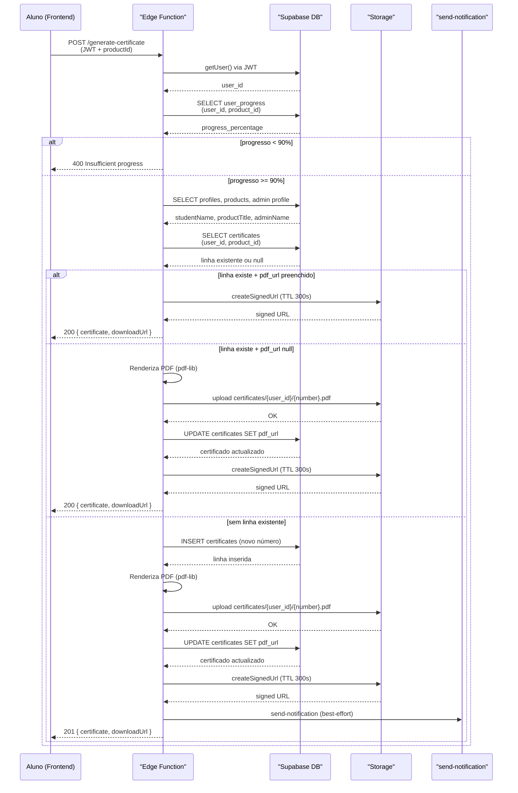
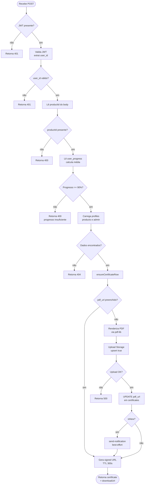
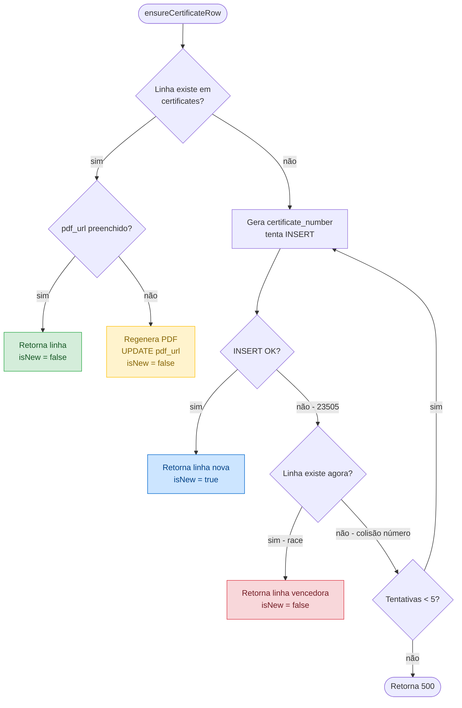
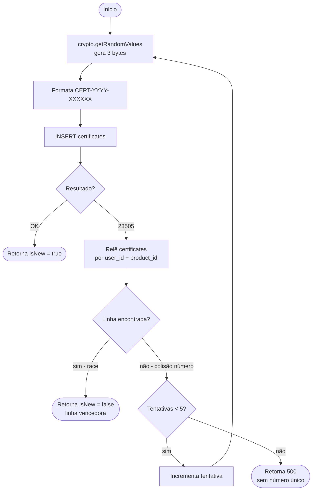
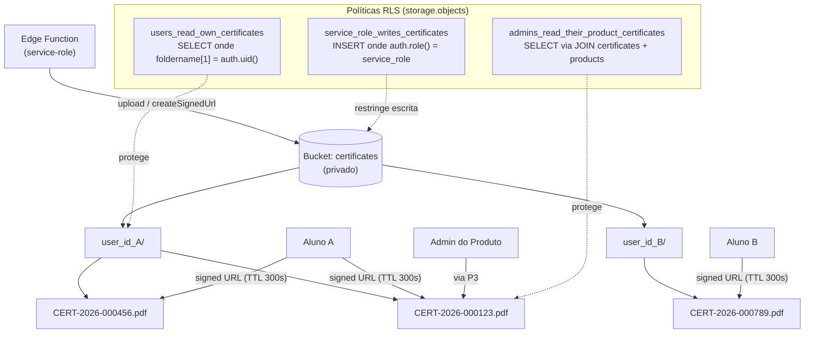
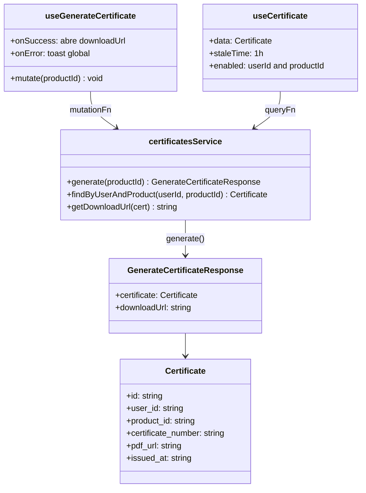
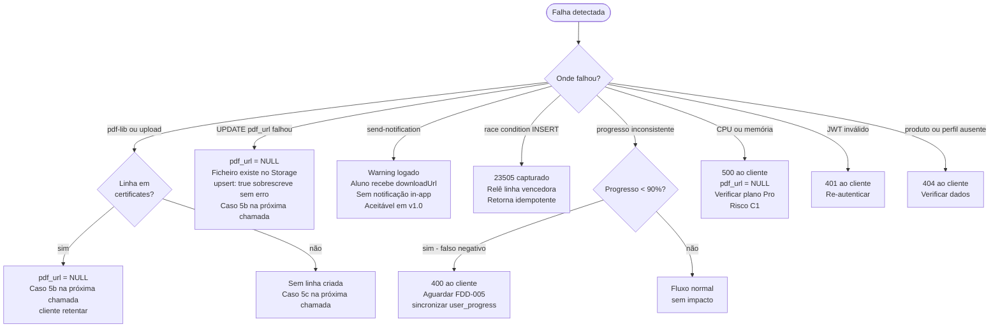

# Diagramas Mermaid - Geração de Certificado

## Visão Geral

A Edge Function `generate-certificate` recebe uma chamada do frontend do aluno, valida autenticação e elegibilidade por progresso (mínimo 90%), garante idempotência via consulta prévia à tabela `certificates`, gera o PDF com `pdf-lib` em A4 landscape, persiste no bucket privado `certificates` e devolve ao frontend a linha do certificado acompanhada de uma signed URL com TTL de 300 s. A função usa dois clientes Supabase distintos: um com o JWT do utilizador (para leituras com RLS) e um com service-role (para escrita em `certificates` e `storage.objects`). Notificação via `send-notification` é disparada em modo best-effort, não interrompendo o fluxo principal em caso de falha.

## Elementos Identificados

### Fluxos Externos

- Frontend (aluno) invoca `certificatesService.generate(productId)` via hook `useGenerateCertificate`
- Edge Function `generate-certificate` recebe POST HTTPS com JWT no header `Authorization`
- Sistema de Progresso (FDD-005) é a fonte de verdade de `user_progress.progress_percentage`
- Edge Function `send-notification` é chamada como best-effort após emissão de certificado novo
- Frontend recebe `{ certificate, downloadUrl }` e abre nova aba para download

### Processos Internos

- Validação JWT e extracção de `user_id`
- Leitura de `user_progress` e cálculo de média de `progress_percentage` por módulos do produto
- Consulta a `certificates` por `(user_id, product_id)` para idempotência
- Geração de número `CERT-YYYY-XXXXXX` com `crypto.getRandomValues`
- Renderização de PDF em A4 landscape com Helvetica / Helvetica-Bold via `pdf-lib`
- Upload para bucket `certificates` com `upsert: true`
- UPDATE de `certificates.pdf_url` com o caminho relativo
- Geração de signed URL com TTL 300 s
- Loop de retry até `MAX_INSERT_ATTEMPTS = 5` para colisão de `certificate_number`
- Captura de erro `23505` diferenciando constraint `(user_id, product_id)` vs `certificate_number`

### Variações de Comportamento

- **Caso 5a (idempotência feliz):** linha existe com `pdf_url` preenchido; retorna imediatamente sem regenerar
- **Caso 5b (recovery):** linha existe com `pdf_url = NULL`; regenera apenas PDF e faz UPDATE
- **Caso 5c (novo):** sem linha; gera número, INSERT, gera PDF, dispara notificação
- **Race condition:** segundo INSERT rejeitado por `UNIQUE(user_id, product_id)` com código `23505`; handler relê linha vencedora
- **Colisão de número:** INSERT rejeitado por `UNIQUE(certificate_number)`; handler retentar com novo número até 5 tentativas

### Contratos Públicos

- `GenerateCertificateResponse { certificate: Certificate, downloadUrl: string }`
- `certificatesService.generate(productId)` / `getDownloadUrl(cert)` / `findByUserAndProduct(userId, productId)`
- `useGenerateCertificate()` mutation / `useCertificate(userId, productId)` query
- Caminho Storage: `{user_id}/{certificate_number}.pdf` no bucket `certificates`
- Signed URL TTL: 300 s
- Threshold de progresso: 90%

---

## Diagramas

### Fluxo End-to-End

Este diagrama de sequência representa o caminho completo desde a acção do aluno no frontend até à entrega da signed URL para download do PDF. Mostra a ordem temporal das interacções entre o frontend, a Edge Function, as tabelas do banco de dados, o Storage e a função de notificação, evidenciando os dois clientes Supabase utilizados (JWT do utilizador e service-role). É o diagrama central para compreender como todos os componentes colaboram numa chamada bem-sucedida de geração de certificado.

**Notas**:
- O cliente JWT do utilizador é usado para `getUser()` e `SELECT user_progress`; o cliente service-role é usado para INSERT/UPDATE em `certificates` e operações em `storage.objects`
- `send-notification` é chamada apenas para certificados novos (`isNew = true`) e erros nesta chamada são capturados como warning sem falhar a resposta
- Status 200 cobre tanto o caso de certificado já existente (5a) quanto o de recovery (5b, linha sem `pdf_url`); status 201 é exclusivo de certificado novo (5c)

---

### Lógica Interna da Edge Function

Este fluxograma detalha os onze passos sequenciais executados dentro da Edge Function `generate-certificate`, incluindo todos os pontos de decisão e as saídas de erro possíveis. É essencial para compreender a ordem das operações e quais falhas interrompem o fluxo (erros lançados) versus quais são absorvidas (notificação best-effort). O diagrama também deixa claro que a renderização do PDF só ocorre quando necessário, tornando o fluxo eficiente para chamadas repetidas.

**Notas**:
- `ensureCertificateRow` encapsula a lógica de idempotência e retry (detalhada no diagrama seguinte); o fluxo aqui assume que retorna com sucesso
- `upload Storage upsert: true` garante que uma retentativa sobrescreve ficheiro parcial sem erro de conflito
- O caminho `pdf_url preenchido = sim` nunca passa por `isNew` porque `isNew = false` nesses casos; a notificação só é disparada para certificados verdadeiramente novos

---

### Máquina de Estados de Idempotência

Este fluxograma representa os três casos de idempotência definidos no FDD (casos 5a, 5b e 5c), mostrando como a Edge Function reage consoante o estado da linha em `certificates` e da presença do ficheiro PDF no Storage. Compreender este diagrama é crítico para perceber por que uma chamada repetida nunca duplica dados nem dispara notificações indevidas. Inclui também o quarto caso de race condition entre chamadas simultâneas, resolvido via captura do erro `23505`.

**Notas**:
- Verde (5a): caminho feliz idempotente; nenhuma operação de escrita ocorre
- Amarelo (5b): recovery; o PDF é regenerado mas nenhuma linha nova é criada e nenhuma notificação é disparada
- Azul (5c): primeira emissão; INSERT, PDF, notificação
- Vermelho (race): duas chamadas simultâneas; a segunda captura `23505` na constraint `UNIQUE(user_id, product_id)`, relê a linha criada pela primeira e retorna idempotente
- O loop de retry (até 5 tentativas) só ocorre quando `23505` refere a constraint `UNIQUE(certificate_number)`; a distinção é feita relendo `certificates` após o erro

---

### Geração de Número com Retry

Este fluxograma foca o mecanismo de geração do `certificate_number` e o loop de retry isolado para colisões estatísticas. O FDD distingue explicitamente dois tipos de violação `UNIQUE` no INSERT: a colisão de `(user_id, product_id)` (race condition, resolvida de forma terminal e idempotente) e a colisão de `certificate_number` (transitória, resolvida por retry com novo número). Compreender esta distinção é importante para garantir que o handler não confunde os dois casos e não entra em loop infinito.

**Notas**:
- `crypto.getRandomValues` produz 3 bytes (24 bits); o número é `(bytes[0] << 16 | bytes[1] << 8 | bytes[2]) % 1_000_000`, resultando em 6 dígitos com distribuição uniforme
- O espaço de valores é 10^6 por ano; o FDD indica revisão de formato (para 8 caracteres) ao atingir 5000 emissões/ano (paradoxo do aniversário)
- A releitura após `23505` é o único mecanismo para distinguir o tipo de constraint violada, pois o Supabase client não expõe o nome da constraint directamente

---

### Estrutura do Bucket e Políticas RLS

Este diagrama representa a organização dos ficheiros no bucket privado `certificates` e as três políticas RLS que controlam o acesso. A estrutura de pasta por `user_id` é central para a política de prefixo do aluno e para facilitar remoção em cascata. O diagrama torna imediatamente visível quais actores podem ler ou escrever e por qual mecanismo, o que é crítico para auditar a segurança da feature.

**Notas**:
- O frontend nunca acede ao Storage directamente; sempre via signed URL gerada pela Edge Function ou pelo `certificatesService.getDownloadUrl()`
- A política `service_role_writes_certificates` garante que apenas a Edge Function pode criar ficheiros; o aluno nunca faz upload directo
- A signed URL tem TTL 300 s, suficiente para download imediato mas demasiado curta para partilha indevida (conforme ADR-006)
- Ficheiros têm limite de 5 MB; PDF típico gerado por `pdf-lib` fica abaixo de 100 KB

---

### Contratos Públicos do ServiceLayer

Este diagrama de classes representa as interfaces e tipos públicos do ServiceLayer e dos hooks que o frontend consome para interagir com a feature de certificado. Evidencia a separação de responsabilidades: `certificatesService` abstrai as chamadas à Edge Function e ao banco de dados, enquanto os hooks `useGenerateCertificate` e `useCertificate` gerem estado de cache via TanStack Query. O diagrama também torna claro que `getDownloadUrl` é usado para acessos posteriores (listagem de certificados), onde a URL original já expirou.

**Notas**:
- `certificatesService` é o único caminho do frontend para esta feature; páginas não invocam directamente a Edge Function
- `staleTime: 1h` no `useCertificate` reflecte que o certificado é imutável após emissão
- `getDownloadUrl` chama `storageService.getSignedUrl('certificates', cert.pdf_url, 300)` e é usado em páginas de listagem onde a URL devolvida no momento da geração já expirou
- Erros propagam como exception conforme o padrão do FDD-003; interceptação de "Insufficient progress" é feita na página `Certificate.tsx`, não no hook

---

### Cenários de Falha e Recuperação

Este fluxograma representa os principais cenários de falha identificados no FDD e os caminhos de recuperação disponíveis para cada um. É especialmente útil para entender o comportamento do sistema quando operações parciais deixam a tabela `certificates` num estado intermédio (linha com `pdf_url = NULL`), e como a idempotência garante que uma nova chamada do cliente resolve o problema sem intervenção manual. Também deixa claro quais falhas são aceites em v1.0 (notificação) e quais exigem retentativa do cliente ou escalamento de plano.

**Notas**:
- O design de idempotência garante que todos os cenários com `pdf_url = NULL` se auto-resolvem na próxima chamada do cliente, sem necessidade de job manual em v1.0
- O Risco C2 do FDD prevê um job de reconciliação periódico para detectar linhas com `pdf_url = NULL` permanentes (ex: cliente nunca retentou)
- Falha por CPU/memória (Risco C1) pode indicar necessidade de migrar para plano Pro; a feature deve ser desabilitada por flag enquanto não validado em staging com plano equivalente
- Progresso inconsistente (Risco C6) é mitigado pelo contrato explícito com FDD-005; em emergência, a Edge Function pode ser configurada para recalcular, comprometendo temporariamente a regra de não recálculo
