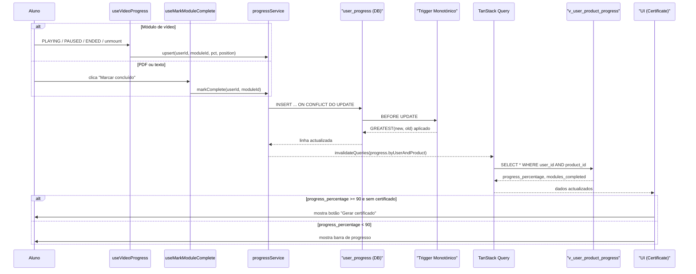
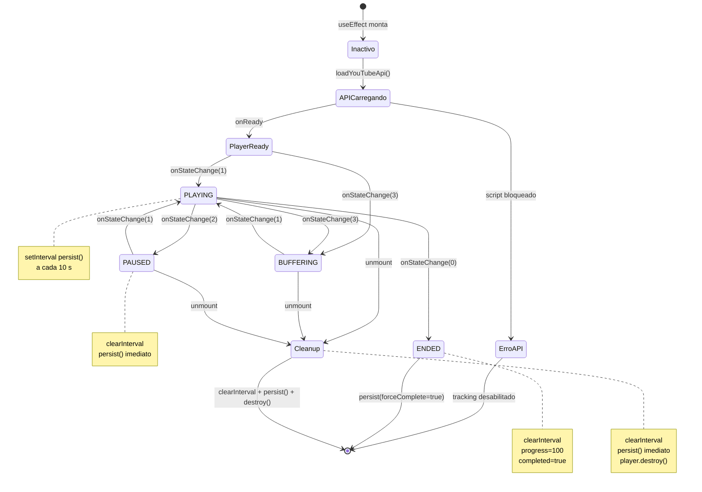
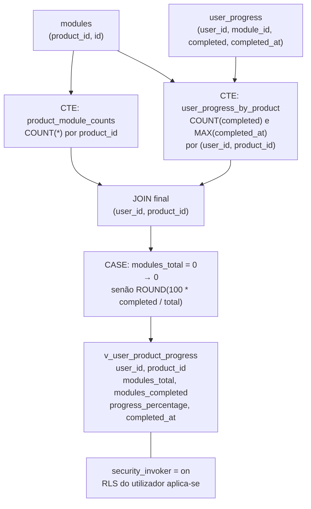
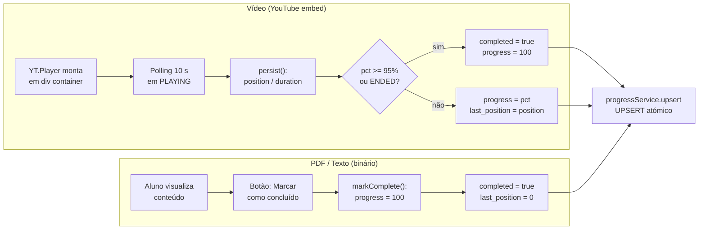
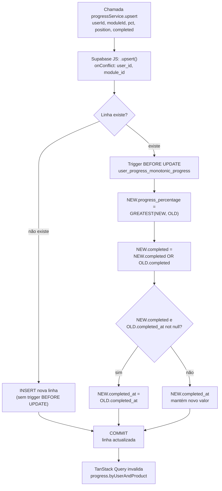
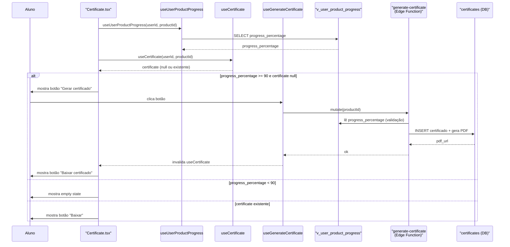
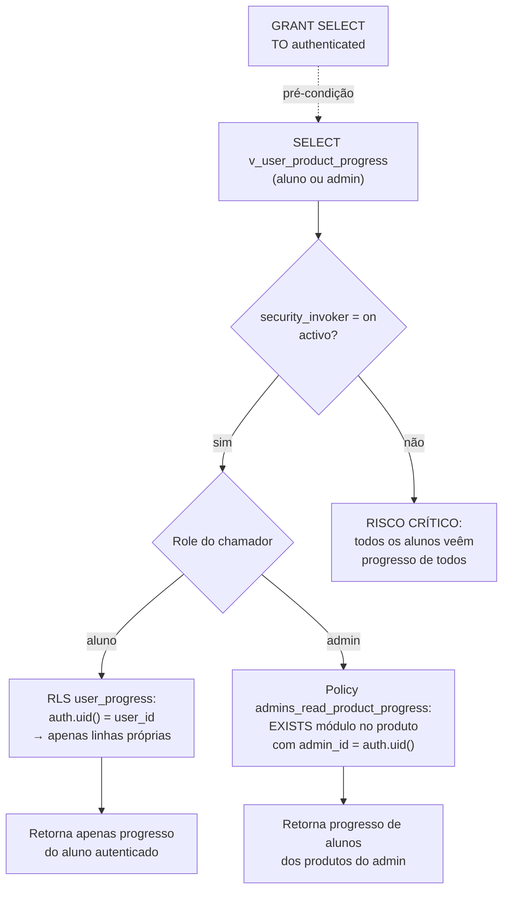
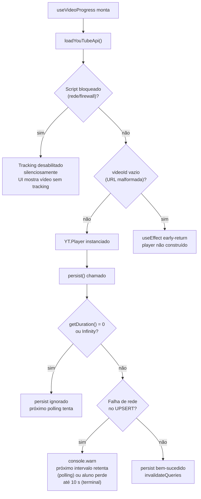

# Diagramas Mermaid — Sistema de Progresso e Certificação (FDD-005)

## Visão Geral

O FDD-005 define a evolução do sistema de progresso e certificação do APP XPRO para v1.0 funcional. O sistema regista progresso real de vídeo através da YouTube IFrame Player API (polling de 10 s em `PLAYING`, persist imediato em `PAUSED`, `ENDED` e unmount), mantém marcação binária para PDF e texto via botão explícito, e centraliza toda a agregação numa view SQL canónica `v_user_product_progress`. A monotonicidade de `progress_percentage` e `completed` é garantida por um trigger `BEFORE UPDATE` no servidor, eliminando regressões por seek-back ou concorrência entre abas. O certificado é disparado client-driven: a UI lê a view e, quando `progress_percentage >= 90` e não existe certificado, disponibiliza o botão ao aluno.

## Elementos Identificados

### Fluxos externos

- Aluno consome módulo de vídeo (YouTube embed via `YT.Player`)
- Aluno consome módulo PDF ou texto (botão "Marcar como concluído")
- Aluno clica "Gerar certificado" (chama `useGenerateCertificate` — FDD-004)
- Edge Function `generate-certificate` lê `v_user_product_progress` (FDD-004 §5.2)

### Processos internos

- Hook `useVideoProgress`: singleton da YouTube IFrame Player API, polling com `setInterval`, persist via `progressService.upsert`
- Hook `useMarkModuleComplete`: mutação que chama `progressService.markComplete`
- `progressService.upsert`: UPSERT atómico com `onConflict: 'user_id,module_id'`
- Trigger SQL `user_progress_monotonic_progress`: aplica `GREATEST` em `progress_percentage` e `OR` em `completed`
- View SQL `v_user_product_progress`: duas CTEs — `product_module_counts` e `user_progress_by_product`
- TanStack Query: invalida chaves `progress.byUserAndProduct` e `progress.byUserAndProductModules` após cada persist
- `useUserProductProgress`: refetch da view após invalidação

### Variações de comportamento

- Tipo de módulo `video`: progresso real (`min(100, round(position/duration*100))`), sentinel de conclusão em 95%
- Tipo de módulo `pdf`: progresso binário 0/100, conclusão por acção explícita
- Tipo de módulo `text`: progresso binário 0/100, conclusão por acção explícita
- Tipo de módulo `quiz`: fora de âmbito v1.0
- Trigger `beforeunload` + `navigator.sendBeacon`: fora de âmbito v1.0 (alvo v1.x)
- Trigger SQL automático via `pg_net`: fora de âmbito v1.0 (alvo v2.0)

### Contratos públicos

- `UserProgress`: tipo derivado de `Database['public']['Tables']['user_progress']['Row']`
- `UserProgressInsert` / `UserProgressUpdate`: tipos de mutação correspondentes
- `UserProductProgress`: interface manual com campos `user_id`, `product_id`, `modules_total`, `modules_completed`, `progress_percentage`, `completed_at`
- `progressService`: métodos `upsert`, `markComplete`, `getByUserAndProduct`, `listModuleProgressByProduct`
- Chaves TanStack Query: `['progress', 'product', userId, productId]` e `['progress', 'modules', userId, productId]`

---

## Diagramas

### Fluxo Principal End-to-End

Este diagrama de sequência representa o fluxo completo desde o consumo de um módulo pelo aluno até à actualização da interface, cobrindo tanto o caminho do vídeo como o do PDF/texto. Mostra como o `progressService` é o único ponto de escrita no sistema, como o trigger de monotonicidade actua no servidor antes do commit, e como o TanStack Query orquestra a invalidação e o refetch da view canónica. A compreensão deste fluxo é essencial porque clarifica a separação entre a camada de hook específica do tipo de módulo e a camada de serviço genérica abaixo dela.

**Notas**:
- `progressService` é o único caminho do frontend para escrever em `user_progress`; páginas não chamam `supabase.from('user_progress')` directamente.
- O trigger `user_progress_monotonic_progress` actua `BEFORE UPDATE`; o cliente pode enviar um valor de `progress_percentage` menor (por seek-back) sem risco de regressão.
- `staleTime: 0` em `useUserProductProgress` garante que cada invalidação desencadeia um refetch imediato da view.

---

### Máquina de Estados do Player de Vídeo (YouTube IFrame Player API)

Este diagrama de estados representa o ciclo de vida do `useVideoProgress` em resposta aos eventos da YouTube IFrame Player API. É um dos elementos mais não-óbvios do sistema porque a API não emite `timeupdate` como o HTML5 e a estratégia de polling precisa de ser suspensa e retomada em função do estado do player. Cada transição de estado inclui a acção de persist ou de polling associada, tornando claro quando o progresso é persistido e quando é apenas acumulado.

**Notas**:
- `BUFFERING` (estado 3) mantém o intervalo activo porque é um glitch de rede, não uma pausa de utilizador.
- `ENDED` (estado 0) força `completed=true` e `progress_percentage=100` independentemente da posição real.
- O estado `Cleanup` representa o caminho de unmount do `useEffect`; pode ocorrer a partir de qualquer estado activo (`PLAYING`, `BUFFERING`, `PAUSED`).
- `loadYouTubeApi()` é um singleton por sessão de browser: a primeira instância do hook injecta o script; instâncias subsequentes esperam a mesma promise.
- `player.destroy()` é envolto em `try/catch` no unmount porque a API pode lançar excepção se chamada antes de o player estar `READY`.

---

### Dependências da View SQL `v_user_product_progress`

Este diagrama de fluxo representa a estrutura interna da view canónica `v_user_product_progress`, mostrando as duas CTEs intermediárias e como se combinam para produzir o `progress_percentage` por `(user_id, product_id)`. É um diagrama arquitecturalmente relevante porque esta view é a fonte de verdade única consumida pela UI, pela Edge Function `generate-certificate`, e pelo admin dashboard — e a sua lógica de agregação nunca deve ser replicada inline. O diagrama torna visível o caminho de dados desde as tabelas base até à coluna `progress_percentage` que aciona o certificado.

**Notas**:
- `security_invoker = on` força a view a correr com a role do utilizador autenticado; a RLS de `user_progress` (`auth.uid() = user_id`) filtra automaticamente as linhas.
- A CTE `product_module_counts` conta todos os módulos do produto, incluindo módulos que o aluno ainda não iniciou.
- O `CASE` protege contra divisão por zero quando `modules_total = 0` (produto sem módulos retorna `progress_percentage = 0`; certificado nunca elegível).
- Quando um módulo é apagado após o aluno o ter concluído, `modules_total` reduz e `progress_percentage` recalcula automaticamente na próxima leitura da view.

---

### Granularidade por Tipo de Módulo

Este diagrama de fluxo compara lado a lado o tratamento de progresso para os três tipos de módulo activos em v1.0: vídeo, PDF e texto. A comparação é necessária porque a granularidade e os mecanismos de conclusão diferem significativamente entre tipos, e o diagrama torna explícita a decisão de que apenas vídeo beneficia de progresso contínuo enquanto PDF e texto mantêm semântica binária. O tipo `quiz` está declarado no enum mas fora de âmbito neste FDD e não aparece neste diagrama.

**Notas**:
- O sentinel de 95% para vídeo cobre o caso comum de aluno que não vê os últimos segundos (créditos, agradecimentos).
- PDF e texto não escrevem em `last_position_seconds` (mantém 0); a funcionalidade "continuar de onde parei" é exclusiva de vídeo.
- A flag `completed` no agregado do produto é binária para todos os tipos: o que varia é como cada tipo a atinge.
- Ambos os caminhos convergem no mesmo `progressService.upsert`, garantindo que a lógica de UPSERT e monotonicidade é partilhada.

---

### UPSERT Atómico e Trigger de Monotonicidade

Este diagrama representa o fluxo de escrita em `user_progress` desde a chamada do `progressService` até ao commit, incluindo a actuação do trigger de monotonicidade. É crítico para compreender como o sistema resolve dois problemas simultâneos: a race condition entre duas abas abertas para o mesmo módulo (resolvida pelo UPSERT atómico) e a regressão de progresso por seek-back (resolvida pelo trigger `BEFORE UPDATE`). Sem este diagrama, a garantia de monotonicidade seria apenas texto e dificilmente comunicável a quem implementa ou revê o código.

**Notas**:
- `last_position_seconds` não é protegido pelo trigger e pode decrescer livremente: representa a posição actual do aluno, não o máximo já visto.
- `completed = true` é sticky: uma vez marcado, o trigger `OR` impede que volte a `false` mesmo que o cliente envie `completed=false`.
- `completed_at` preserva o timestamp original da primeira conclusão; se o módulo for concluído de novo (idempotente), a data não muda.
- O `UPSERT` com `onConflict` substitui o padrão anterior de SELECT + UPDATE/INSERT manual, eliminando a race condition entre verificar e escrever.

---

### Disparo Client-Driven do Certificado

Este diagrama de sequência representa o fluxo específico de verificação de elegibilidade e disparo do certificado, que é separado do fluxo de persist de progresso. É um diagrama relevante porque a lógica client-driven em v1.0 é uma decisão arquitectural consciente (sem `pg_net`, sem trigger automático) e o fluxo envolve dois hooks distintos (`useUserProductProgress` e `useCertificate`) que precisam de ser consultados em conjunto para determinar o estado da UI. O diagrama também deixa claro que a geração do PDF é responsabilidade da Edge Function `generate-certificate` (FDD-004).

**Notas**:
- A view `v_user_product_progress` é consultada tanto pela UI (para verificar elegibilidade) como pela Edge Function `generate-certificate` (para validação interna antes de emitir o PDF).
- O threshold de elegibilidade para o certificado é `progress_percentage >= 90` (90% dos módulos com `completed=true`), diferente do sentinel de conclusão de vídeo (95%).
- Em v2.0, o trigger SQL via `pg_net` substituirá este fluxo client-driven, emitindo o certificado automaticamente quando o aluno atingir 90%.
- O aluno controla o momento de emissão em v1.0, permitindo que reveja o conteúdo antes de gerar o certificado.

---

### Segurança da View: RLS e `security_invoker`

Este diagrama representa como as camadas de segurança se combinam para garantir que cada utilizador (aluno ou admin) acede apenas ao progresso a que tem direito. A relevância deste diagrama justifica-se pelo Risco P6 (vazamento entre alunos por ausência de `security_invoker`) e P7 (vazamento entre admins por policy mal escrita) identificados no FDD. O diagrama torna explícito o mecanismo pelo qual a view herda a RLS do utilizador autenticado e como a policy `admins_read_product_progress` alarga o acesso de forma segura para admins.

**Notas**:
- `security_invoker = on` faz com que a view execute com a role do utilizador autenticado, não com a role do owner da view; sem este flag, a RLS de `user_progress` seria ignorada.
- A policy `admins_read_product_progress` usa `EXISTS` com JOIN em `modules` e `products` filtrando `p.admin_id = auth.uid()`, impedindo que admin A veja progresso de produtos de admin B.
- A view herda automaticamente a policy adicional via `security_invoker`: não é necessário duplicar a lógica de segurança na view.
- A validação manual com duas contas de aluno e duas contas de admin em staging é pré-condição de deploy (§9.2 PR 1 e PR 6).

---

### Tratamento de Erros no Player de Vídeo

Este diagrama representa os cenários de falha mais relevantes no ciclo de vida do `useVideoProgress` e o comportamento do sistema em cada caso. É um diagrama necessário porque os erros no contexto da YouTube IFrame Player API são silenciosos por design (não interrompem o playback) e o seu tratamento é não-óbvio para quem mantém o código. O diagrama cobre os cenários identificados na secção §6.1 do FDD que têm impacto de nível médio ou superior.

**Notas**:
- Nenhum erro no player interrompe o playback do vídeo; todos são tratados como "tracking silenciosamente degradado".
- A validação `duration > 0 && isFinite(duration)` protege contra leituras antecipadas (player ainda não `READY`); o próximo intervalo de 10 s tentará de novo.
- Quando o aluno fecha a aba bruscamente, o cleanup do `useEffect` pode não correr; v1.0 aceita perda de até 10 s desde o último persist bem-sucedido (Risco P2).
- `videoId` vazio por URL malformada em `module.video_url` resulta em early-return silencioso; nenhum tracking acontece para aquele módulo.
