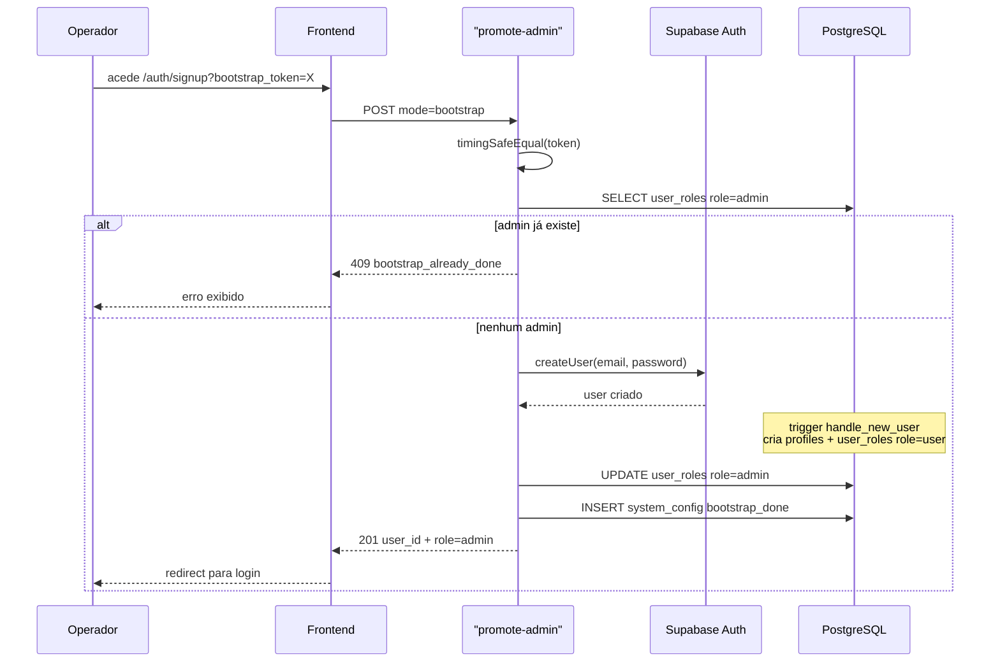
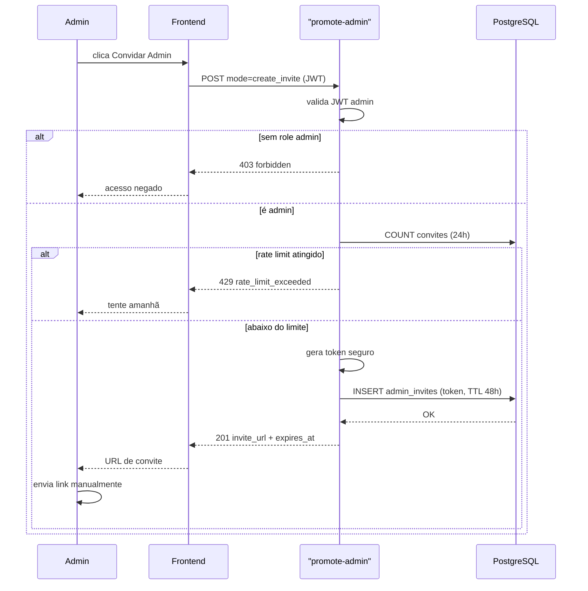
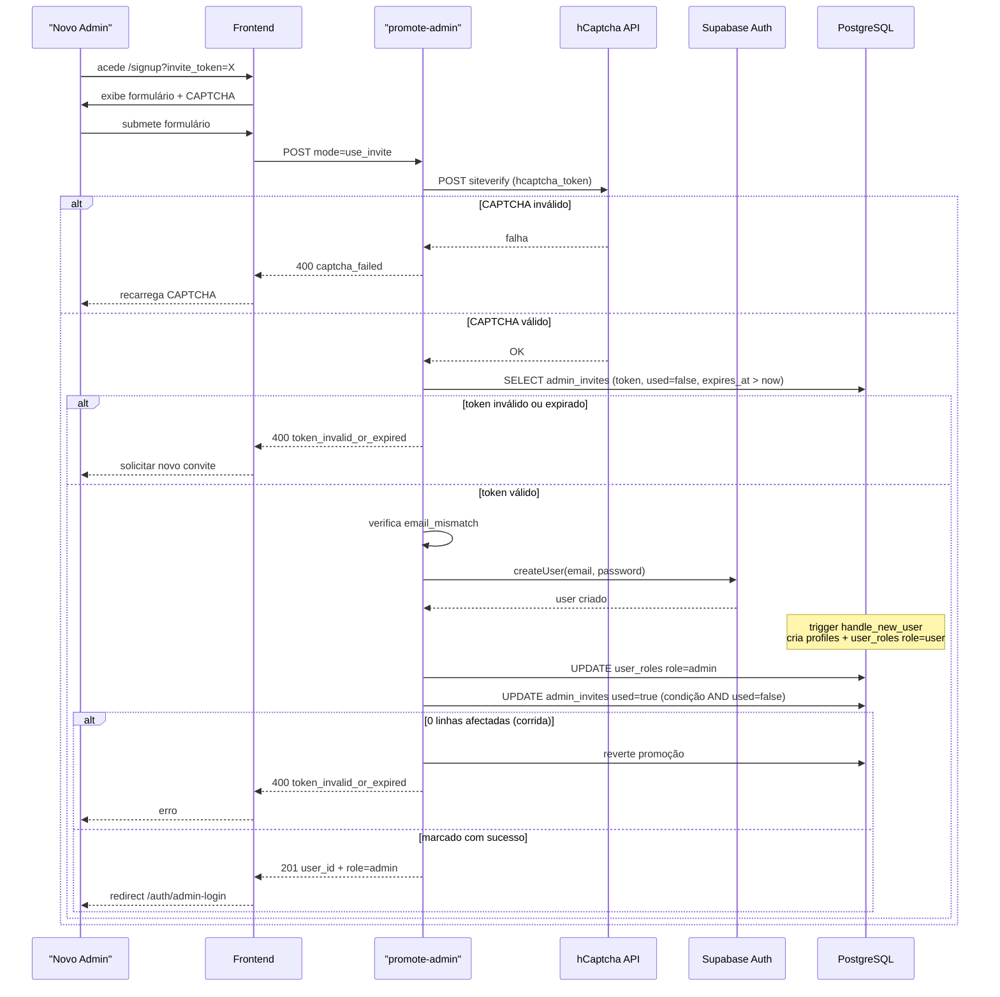
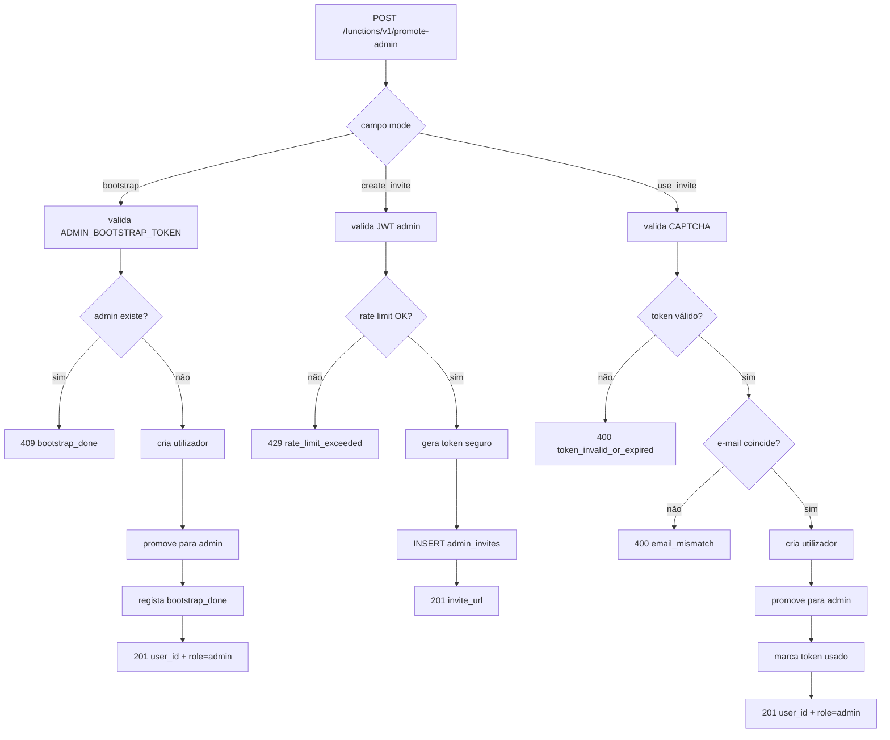
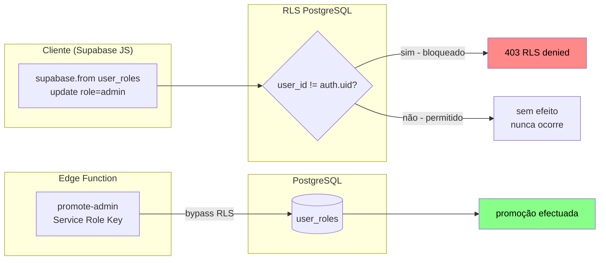
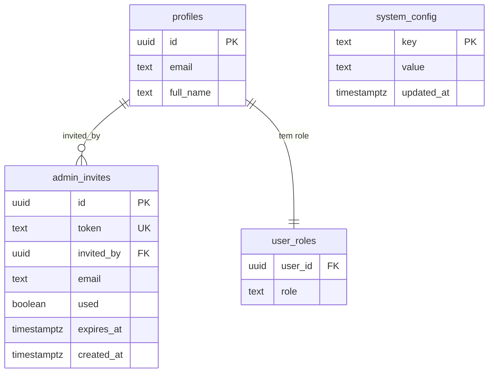
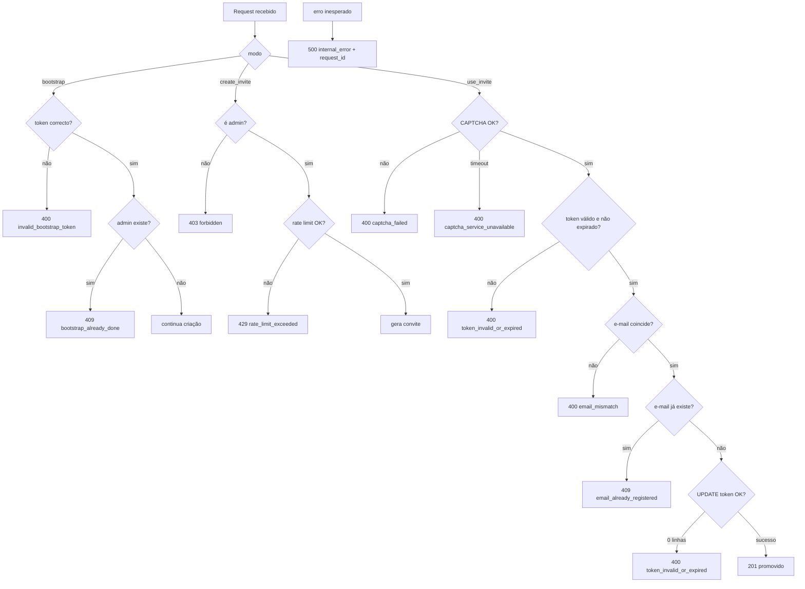
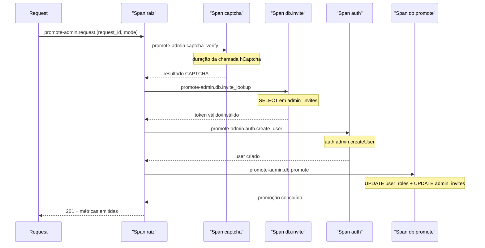

# Diagramas Mermaid - Promoção de Admin

## Visão Geral

O FDD descreve o mecanismo seguro de promoção de utilizadores ao papel de admin na plataforma APP XPRO. O fluxo inseguro existente (UPDATE directo em `user_roles` pelo cliente) é substituído por dois caminhos protegidos: bootstrap inicial via token de ambiente e sistema de convites com validação server-side. Toda promoção passa exclusivamente pela Edge Function `promote-admin`, que usa Service Role Key para contornar RLS de forma controlada e auditada. O `/auth/signup` público é desactivado após o bootstrap.

## Elementos Identificados

### Fluxos externos

- Operador acede `/auth/signup?bootstrap_token=<valor>` para criar o primeiro admin
- Admin existente invoca Edge Function com JWT para gerar convite
- Novo admin acede `/auth/signup?invite_token=<token>` e submete formulário com CAPTCHA
- hCaptcha API valida token de CAPTCHA antes de qualquer criação de utilizador
- Supabase Auth Admin API (`auth.admin.createUser`) cria utilizadores com e-mail confirmado

### Processos internos

- Edge Function `promote-admin` com três modos: `bootstrap`, `create_invite`, `use_invite`
- Trigger SQL `handle_new_user` cria `profiles` e `user_roles` com `role = 'user'` por defeito
- UPDATE directo em `user_roles` via Service Role Key (bypass de RLS)
- Verificação atómica de token: `UPDATE admin_invites SET used = true WHERE token = X AND used = false`
- Rate limit contado por `invited_by` nas últimas 24h em `admin_invites`
- Registo de bootstrap em `system_config` com chave `bootstrap_done`

### Variações de comportamento

- Modo `bootstrap`: sem JWT; validado por `ADMIN_BOOTSTRAP_TOKEN` de ambiente; executável apenas uma vez
- Modo `create_invite`: requer JWT de admin; sujeito a rate limit de 5 por 24h
- Modo `use_invite`: sem JWT; validado por `invite_token` + CAPTCHA hCaptcha
- CAPTCHA desactivável via variável de ambiente `HCAPTCHA_ENABLED=false` (emergência)
- Convite pode ter e-mail restrito ou ser aberto

### Contratos públicos

- Edge Function `promote-admin`: `POST /functions/v1/promote-admin`
- Função SQL `promote_to_admin(target_user_id uuid)` SECURITY DEFINER (uso futuro via RPC)
- Endpoint PostgREST para listagem de convites: `GET /rest/v1/admin_invites`
- Tabelas: `admin_invites`, `system_config`
- Respostas: 201, 400, 403, 409, 429, 500

---

## Diagramas

### Bootstrap do Primeiro Admin

Este diagrama de sequência representa o fluxo A, que é executado exactamente uma vez durante o setup inicial da plataforma. O operador envia as credenciais e o `ADMIN_BOOTSTRAP_TOKEN` para a Edge Function, que valida o token por comparação de tempo constante e verifica a ausência de admins existentes antes de criar o utilizador. A Edge Function usa Service Role Key para promover o utilizador a admin e regista o flag `bootstrap_done` em `system_config`, tornando o token inútil em execuções subsequentes. Compreender este fluxo é essencial porque define a sequência de pre-checks que impedem criações duplicadas e expõe a dependência do trigger SQL `handle_new_user`.

**Notas:**

- `timingSafeEqual` previne ataques de temporização na comparação do token de ambiente
- O SELECT em `user_roles` é feito antes de chamar `createUser` para evitar criar utilizador desnecessariamente
- O trigger `handle_new_user` é uma dependência implícita: sem ele, não há linha em `user_roles` para o UPDATE subsequente
- Após o INSERT em `system_config`, nova execução de bootstrap retorna 409 mesmo que o token de ambiente ainda exista

---

### Geração de Convite por Admin

Este diagrama de sequência representa o fluxo B, em que um admin autenticado solicita a criação de um link de convite para um novo admin. A Edge Function valida o JWT, verifica o papel do chamador e aplica o rate limit antes de gerar o token criptograficamente seguro. O resultado é um URL de convite com TTL de 48h que o admin deve copiar e enviar manualmente, pois não há envio automático de e-mail nesta versão. O diagrama é relevante para compreender onde o rate limit é verificado e como o token é armazenado.

**Notas:**

- O rate limit é verificado contando registos em `admin_invites` com `invited_by = auth.uid()` criados nas últimas 24h; não há tabela separada de contadores
- O token é gerado com `crypto.randomUUID()` mais sufixo aleatório de 16 bytes em hex para entropia elevada
- O convite pode incluir ou não um e-mail restrito; quando presente, o uso do convite valida correspondência de e-mail
- Não há envio automático de e-mail para convites de admin em v1.0; o admin copia e envia o link manualmente

---

### Uso de Convite pelo Novo Admin

Este diagrama de sequência representa o fluxo C, que é o mais complexo da feature por envolver CAPTCHA, validação de token, criação de utilizador e marcação atómica do convite. A Edge Function valida o CAPTCHA antes de qualquer operação em base de dados, depois busca e valida o token, cria o utilizador e executa a promoção, e finalmente marca o token como usado numa operação protegida contra condição de corrida. Este é o caminho mais crítico para a segurança do sistema porque encadeia múltiplas validações sequenciais onde qualquer falha deve reverter a promoção.

**Notas:**

- O CAPTCHA é validado primeiro, antes de qualquer consulta à base de dados, para mitigar bots o mais cedo possível
- O SELECT em `admin_invites` usa `FOR UPDATE` para serializar acesso concorrente ao mesmo token
- A marcação `used = true` usa `WHERE token = X AND used = false` com verificação de `FOUND`; se 0 linhas afectadas, a promoção é revertida e retorna 400
- A mensagem de erro para token expirado e token já usado é idêntica (`token_invalid_or_expired`) para evitar enumeração de estado

---

### Modos da Edge Function

Este diagrama de fluxo mostra os três modos de operação da Edge Function `promote-admin` e como cada um determina o caminho de validação e o resultado. O ponto de entrada é único (um só endpoint POST), mas o campo `mode` no corpo do request determina o ramo de execução: `bootstrap` sem JWT, `create_invite` com JWT de admin, e `use_invite` com token de convite e CAPTCHA. O diagrama é útil para compreender rapidamente qual autenticação é exigida em cada modo e qual o resultado esperado.

**Notas:**

- Os modos `bootstrap` e `use_invite` não requerem JWT; a autenticação é feita pelo token do body
- O modo `create_invite` requer JWT de admin no header `Authorization: Bearer <token>`
- A função SQL `promote_to_admin` (SECURITY DEFINER) não é chamada em nenhum dos três modos actuais; toda promoção usa UPDATE directo com Service Role Key
- O campo `mode` é o único discriminador de ramo; não há sub-rotas separadas

---

### Modelo de Segurança e RLS

Este diagrama de fluxo ilustra as camadas de defesa que tornam impossível a auto-promoção directa pelo cliente. A política RLS em `user_roles` bloqueia qualquer UPDATE pelo próprio utilizador, e toda promoção legítima passa pela Edge Function com Service Role Key, que é o único contexto autorizado a contornar o RLS de forma controlada. O diagrama responde à motivação central do FDD: como o sistema garante que probabilidade de bypass é 0% se RLS e Edge Function estiverem correctos.

**Notas:**

- A política RLS usa `USING (user_id != auth.uid())` na policy de UPDATE; um utilizador não pode nunca alterar a sua própria linha
- O bypass de RLS via Service Role Key é exclusivo da Edge Function; nenhum código de cliente tem acesso à Service Role Key
- A remoção do UPDATE directo em `Signup.tsx` elimina o único ponto onde o cliente conseguia promover-se antes desta feature
- A função SQL `promote_to_admin` valida `has_role(auth.uid(), 'admin')` internamente, mas não é usada pelo caminho actual da Edge Function

---

### Schema das Tabelas e Relacionamentos

Este diagrama de entidades representa as duas novas tabelas introduzidas pela feature (`admin_invites` e `system_config`) e o seu relacionamento com a tabela `profiles` existente. A tabela `admin_invites` regista cada convite gerado com o seu estado de uso, TTL e restrição opcional de e-mail, enquanto `system_config` funciona como repositório de flags de configuração da plataforma. Compreender o schema é essencial para verificar as políticas RLS e os índices que garantem eficiência nas consultas de validação de token.

**Notas:**

- O índice `idx_admin_invites_token WHERE used = false` é parcial: apenas tokens não usados são indexados, optimizando as consultas de validação
- O índice `idx_admin_invites_invited_by` cobre `(invited_by, created_at)` para eficiência do rate limit (COUNT nas últimas 24h)
- `system_config` usa `key` como PRIMARY KEY com `ON CONFLICT (key) DO NOTHING` para idempotência do bootstrap
- `admin_invites.email` é nullable: quando null, o convite é aberto; quando preenchido, o e-mail do formulário deve corresponder

---

### Matriz de Erros e Fallbacks

Este diagrama de fluxo mapeia as condições de erro mais críticas e os seus tratamentos, permitindo compreender o comportamento do sistema perante entradas inválidas, falhas externas e condições de corrida. Cada código de resposta HTTP corresponde a uma condição específica sem ambiguidade, excepto nos casos onde a ambiguidade é intencional (token expirado vs. token já usado retornam o mesmo código para evitar enumeração). O diagrama é valioso para quem implementa o cliente ou testa os critérios de aceite.

**Notas:**

- Token expirado e token já usado retornam o mesmo código `400 token_invalid_or_expired` deliberadamente para impedir enumeração de estado
- O fallback manual quando a Edge Function está indisponível é: criar utilizador via Supabase Auth Dashboard e executar UPDATE em `user_roles` com Service Role Key no SQL Editor
- `CAPTCHA_service_unavailable` (timeout de 10s na API hCaptcha) gera alerta de observabilidade mesmo retornando 400 ao cliente
- O `request_id` incluído em respostas 500 é um UUID v4 gerado por request e correlacionado nos logs estruturados

---

### Spans de Tracing e Observabilidade

Este diagrama de sequência representa a estrutura de spans de tracing gerados pela Edge Function durante o modo `use_invite`, que é o caminho com maior número de dependências externas. Cada operação significativa é envolvida num span filho com nome padronizado, permitindo identificar qual etapa contribui para latência elevada. O diagrama é relevante para operação e diagnóstico porque o SLA de p95 < 5s inclui a chamada à API hCaptcha, que é a dependência externa com maior variabilidade.

**Notas:**

- Amostragem de 100% em v1.0 dado o volume baixo esperado de operações de promoção de admin
- Campos nunca logados: `bootstrap_token`, `invite_token` em texto puro, senha e JWT completo; `user_id` e `email` são logados apenas como hash SHA-256 com salt
- Alerta configurado: `promote_admin.captcha.failure > 10 em 5 minutos` indica actividade de bot; canal de notificação é e-mail do operador
- Alerta configurado: `promote_admin.error{code=500} > 0` indica falha crítica e requer atenção imediata
