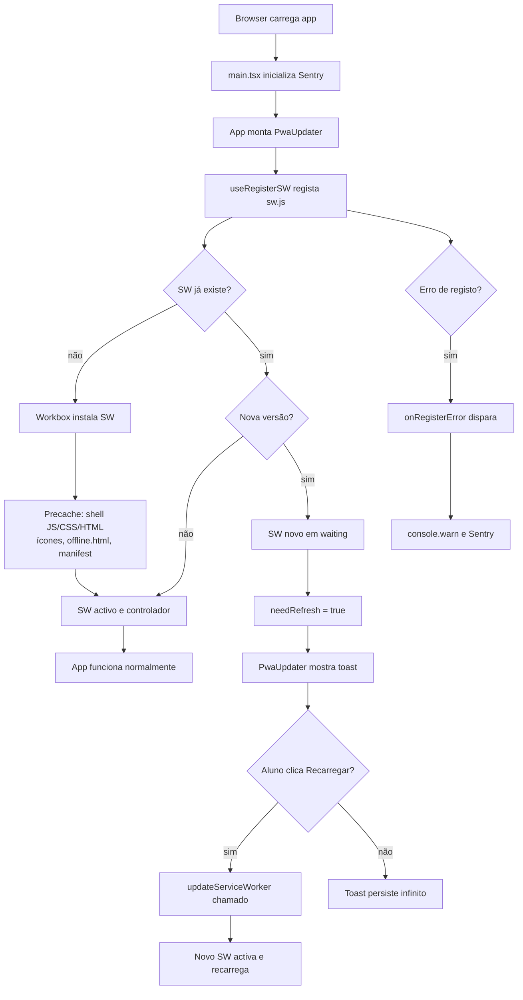
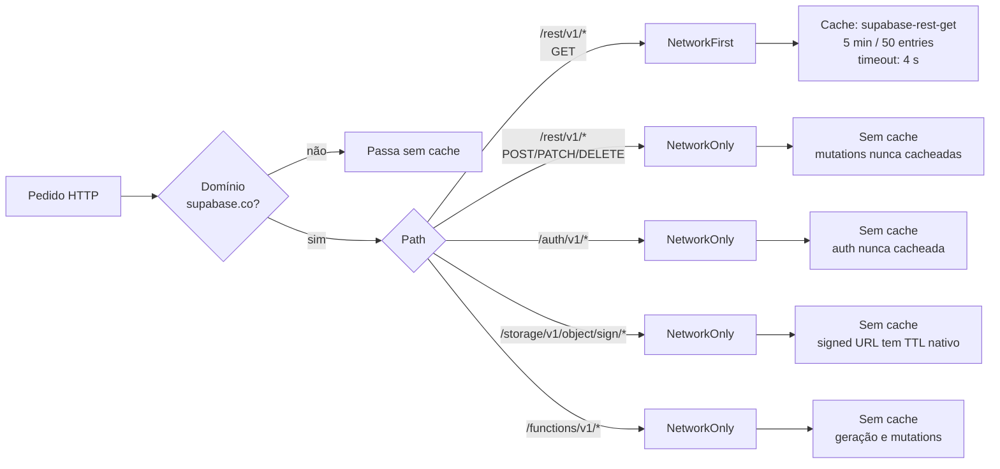
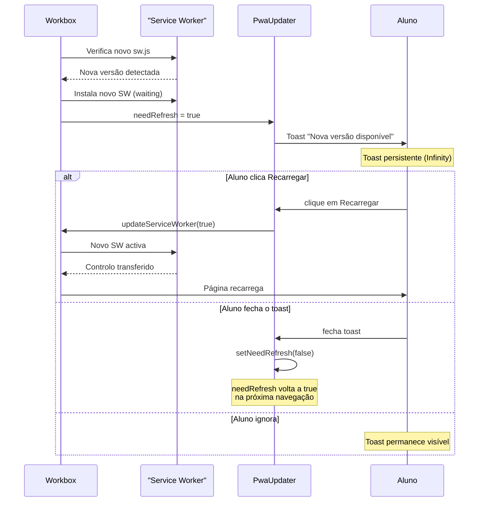
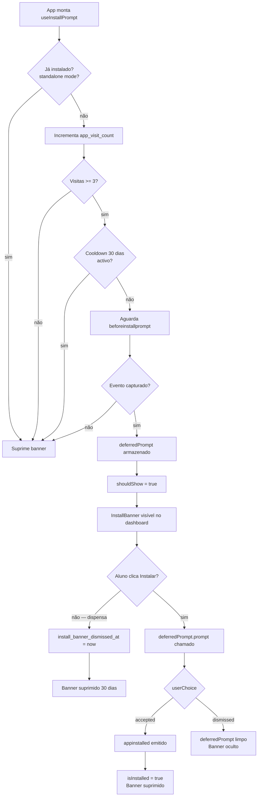
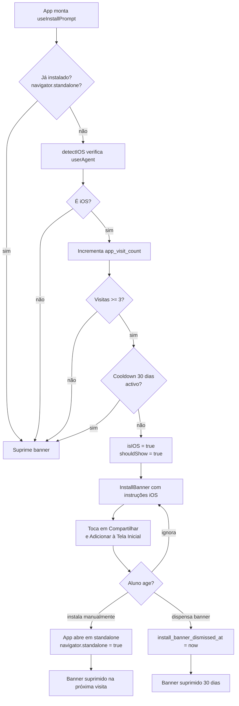
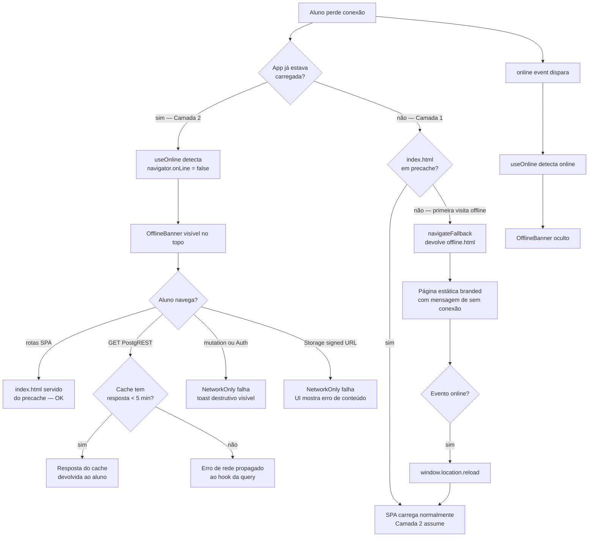
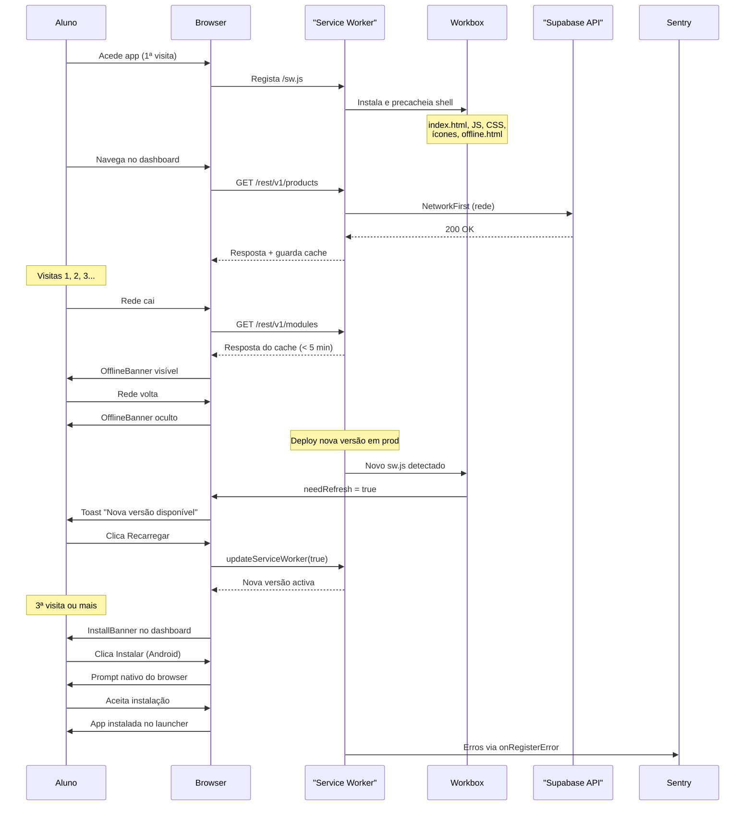

# Diagramas Mermaid — FDD-006 PWA Shell

## Visão Geral

O FDD-006 define a evolução da implementação parcial de PWA da APP XPRO para uma instalação completa que fecha o Risco 6 do HLD ("PWA prometido mas não implementado funcionalmente"). As cinco peças em falta são: caching de chamadas Supabase por estratégia, mecanismo de update explícito via toast, offline fallback em duas camadas, prompt de instalação client-driven, e validação Lighthouse com score >= 90. Todos os componentes são implementados com `vite-plugin-pwa` + Workbox e integrados ao Sentry para captura de erros do Service Worker.

## Elementos Identificados

### Fluxos Externos

- Aluno acede a `https://app.appxpro.com` pelo browser
- Workbox intercepta chamadas a `*.supabase.co` por path pattern
- Evento `beforeinstallprompt` emitido pelo browser (Android/Chrome/Edge)
- Evento `appinstalled` emitido pelo browser após instalação confirmada
- Sentry recebe erros via `onRegisterError` do `useRegisterSW`

### Processos Internos

- `useRegisterSW` regista `/sw.js`; Workbox faz precache de shell, ícones, `offline.html`
- `PwaUpdater` monta no root do `<App>` e escuta `needRefresh`
- `useOnline` detecta `navigator.onLine` e eventos `online`/`offline`
- `OfflineBanner` monta em `AdminLayout` e layout do aluno
- `useInstallPrompt` conta visitas em `localStorage` (`app_visit_count`), armazena `deferredPrompt`, detecta iOS, aplica cooldown de 30 dias
- `InstallBanner` monta em `student/Dashboard.tsx`

### Variações de Comportamento

- `registerType: "prompt"` substitui `"autoUpdate"` silencioso
- Android/Chrome/Edge: prompt nativo via `deferredPrompt.prompt()`
- iOS: instruções manuais ("Compartilhar → Adicionar à Tela Inicial"); sem `beforeinstallprompt`
- Offline com `index.html` em cache: SPA navega normalmente; REST falha com erro tratado
- Offline sem `index.html` em cache (primeira visita): `/public/offline.html` como fallback defensivo
- Sessão activa com rede caída: `OfflineBanner` visível; dados de GET servidos por cache até 5 min

### Contratos Públicos

- `useRegisterSW`: expõe `needRefresh`, `offlineReady`, `updateServiceWorker`, `onRegisterError`
- `useOnline`: retorna `boolean` reactivo
- `useInstallPrompt`: retorna `{ shouldShow, isIOS, isInstalled, promptInstall, dismiss }`
- Workbox `runtimeCaching`: 5 regras Supabase + 2 Google Fonts (já existentes)
- Critério de aceitação: Lighthouse PWA score >= 90 em Chrome DevTools (Android emulado)

---

## Diagramas

### Ciclo de Vida do Service Worker

Este diagrama de fluxo representa o ciclo completo de vida do Service Worker desde o carregamento inicial da aplicação até à activação de uma nova versão pelo aluno. Cobre o caminho feliz (primeira visita, precache, uso normal) e o caminho de actualização (novo SW detectado, toast de update, reload). Compreender este ciclo é fundamental para entender como todas as peças do FDD-006 se encaixam, em particular a diferença entre `registerType: "prompt"` e `autoUpdate`. O diagrama também inclui o ponto de captura de erros do Service Worker pelo Sentry via `onRegisterError`.

**Notas:**
- `registerType: "prompt"` garante que o SW novo aguarda em `waiting` até o aluno confirmar
- `duration: Infinity` no toast impede que a notificação desapareça automaticamente
- `onRegisterError` é o único ponto onde erros de registo do SW chegam ao Sentry
- Se o registo falha, a app continua a funcionar sem cache offline nessa sessão

---

### Estratégias de Caching Supabase

Este diagrama de fluxo horizontal mostra como o Workbox classifica cada pedido HTTP ao domínio Supabase e aplica a estratégia de caching correspondente. É a visualização directa da tabela de decisão do §3.2 do FDD, a peça arquitectural mais crítica desta feature. Cada ramo representa um URL pattern distinto e conduz à estratégia escolhida e à sua justificação. Compreender este diagrama é essencial para qualquer developer que necessite de adicionar, modificar ou depurar uma regra de caching.

**Notas:**
- `NetworkFirst` em GET REST: tenta a rede primeiro; usa cache se rede demorar mais de 4 s ou falhar
- `NetworkOnly` em mutations: POST, PATCH e DELETE nunca são cacheados para evitar inconsistências
- PDFs do Storage privado são excluídos deliberadamente (HLD §285); não há regra para `/storage/v1/object/public/*`
- Vídeos YouTube embed correm num iframe isolado; o Service Worker nunca os intercepta
- Google Fonts (`googleapis.com`, `gstatic.com`) têm regras `CacheFirst` pré-existentes (não mostradas; fora do âmbito deste FDD)

---

### Fluxo de Update Prompt

Este diagrama de sequência representa a interacção entre o browser, o Workbox, o componente `PwaUpdater` e o aluno quando uma nova versão da aplicação é detectada em produção. Ilustra como `registerType: "prompt"` difere do `autoUpdate` silencioso: o aluno retém o controlo sobre quando a nova versão entra em vigor, o que é crítico em sessões longas de vídeo. O diagrama cobre desde a detecção do novo Service Worker até ao reload da página com a versão actualizada.

**Notas:**
- O SW novo fica em `waiting` e nunca activa automaticamente (diferença-chave do `autoUpdate`)
- `updateServiceWorker(true)` activa o novo SW em waiting e força reload da página
- Se o aluno fecha o toast sem recarregar, `needRefresh` voltará a `true` na próxima navegação, re-exibindo o toast
- Sessões longas de vídeo ficam protegidas contra troca silenciosa de cache a meio da aula

---

### Instalação em Android e Chrome

Este diagrama de fluxo representa o caminho de instalação do PWA em Android (Chrome ou Edge), onde o browser emite o evento `beforeinstallprompt`. Mostra toda a lógica do hook `useInstallPrompt` desde o primeiro mount até ao resultado da escolha do aluno. É importante para compreender os requisitos de elegibilidade (3 visitas, cooldown, modo standalone) e o que acontece após a escolha do utilizador. O diagrama cobre também o caso em que o browser não suporta o evento (resultando em supressão do banner).

**Notas:**
- `isInStandalone()` verifica `display-mode: standalone` e `navigator.standalone` (Safari iOS)
- O evento `beforeinstallprompt` só é emitido se a app cumprir os critérios de instalabilidade do browser (HTTPS, manifest, SW)
- `app_visit_count` e `install_banner_dismissed_at` são persistidos em `localStorage`
- Modo private browsing no Safari não persiste `localStorage`; nesse caso o banner pode reaparecer a cada sessão (risco W7)

---

### Instalação em iOS (Safari)

Este diagrama de fluxo representa o caminho de instalação em iOS, onde o evento `beforeinstallprompt` não existe e a instalação é sempre manual via o menu de partilha do Safari. Complementa o diagrama anterior e é necessário para compreender a divergência de UX entre plataformas documentada no §3.4 do FDD. O hook `useInstallPrompt` trata ambos os caminhos, mas o banner e as instruções apresentadas ao aluno são diferentes.

**Notas:**
- iOS não emite `beforeinstallprompt`; `deferredPrompt` permanece `null` para sempre nesta plataforma
- `detectIOS()` usa `/iPad|iPhone|iPod/.test(navigator.userAgent)` conforme implementação do §5.6
- Após instalação manual, o banner desaparece na próxima visita porque `navigator.standalone === true`
- Splash automático do iOS 13+ é gerado a partir do ícone de homescreen + `theme-color` sem `apple-touch-startup-image` dedicadas (decisão §3.5)

---

### Offline Fallback em Duas Camadas

Este diagrama de fluxo representa as duas camadas de fallback quando a conectividade falha, documentadas no §3.3 do FDD. A Camada 1 é defensiva e cobre o pior cenário — quando o browser não consegue navegar de todo. A Camada 2 é reactiva e cobre o cenário comum — app já carregada mas rede cai durante a sessão. Compreender a separação de responsabilidades entre as duas camadas é essencial para perceber o que funciona offline e o que não funciona.

**Notas:**
- `navigateFallback: '/index.html'` cobre o caminho normal (SPA); `offline.html` é fallback defensivo se `index.html` não estiver cacheado
- `offline.html` está em `includeAssets` e entra no precache em todos os deploys
- Vídeos YouTube embed falham silenciosamente offline (iframe isolado; fora do Service Worker)
- PDFs do Storage privado também falham offline (NetworkOnly deliberado, HLD §285)
- `online` event no `offline.html` dispara `window.location.reload()` para retomar automaticamente

---

### Fluxo End-to-End do Aluno

Este diagrama de sequência representa o fluxo completo do aluno desde a primeira visita à aplicação até à interacção com o banner de instalação após múltiplas visitas. Integra todos os componentes do FDD-006 numa única vista temporal: registo do Service Worker, caching Supabase, detecção de nova versão, e prompt de instalação. É o diagrama mais abrangente e serve como mapa de orientação para qualquer developer que esteja a implementar ou a depurar a feature.

**Notas:**
- O precache ocorre apenas na primeira visita ou após cada novo deploy; nas visitas seguintes o SW já está activo
- `OfflineBanner` (Camada 2) aparece imediatamente quando `navigator.onLine` muda para `false`
- O toast de update pode aparecer durante qualquer visita activa em que haja um deploy em background
- O `InstallBanner` só aparece se `shouldShow = true` (>= 3 visitas, sem cooldown, `deferredPrompt` capturado ou iOS)
- Erros de registo do SW são sempre enviados ao Sentry; a app continua a funcionar sem SW em caso de falha
