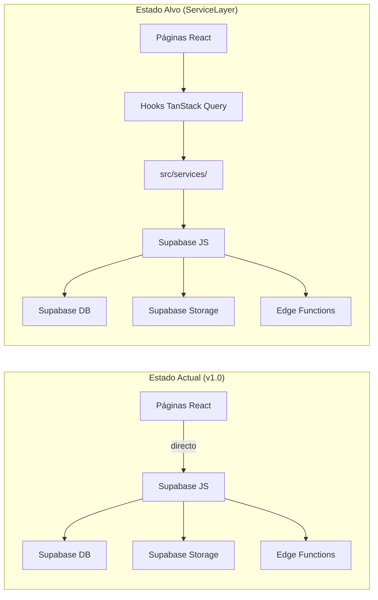
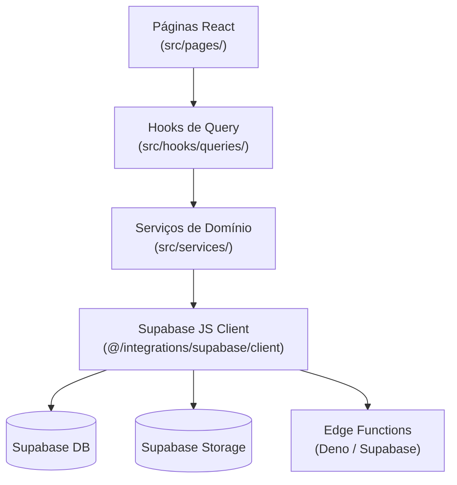
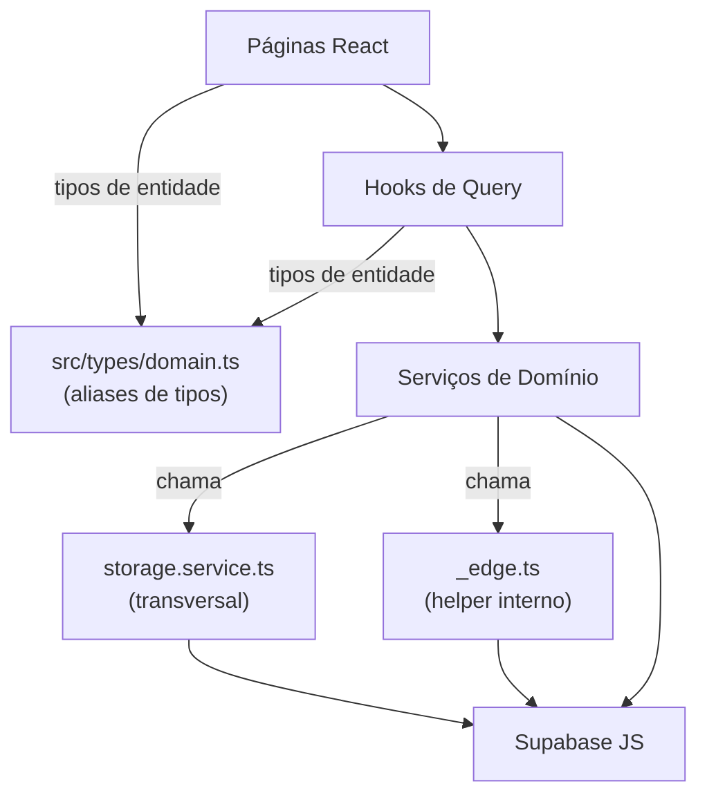
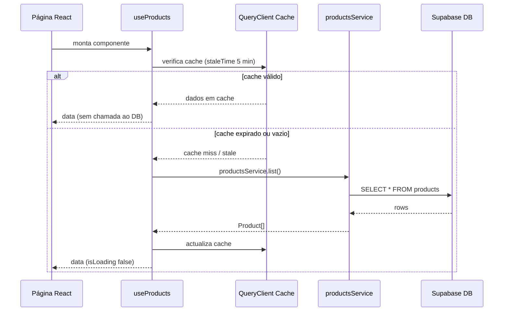
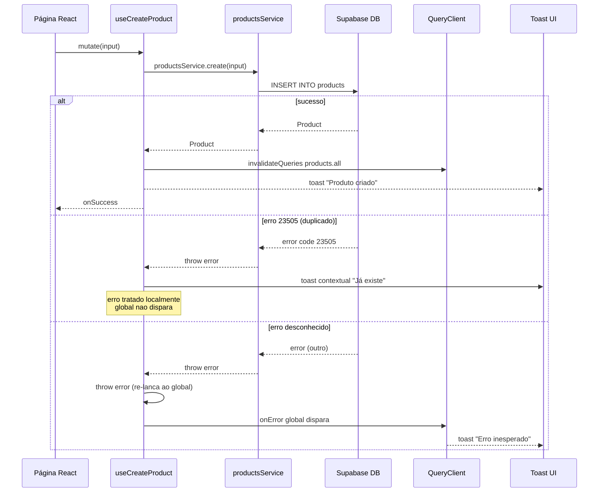
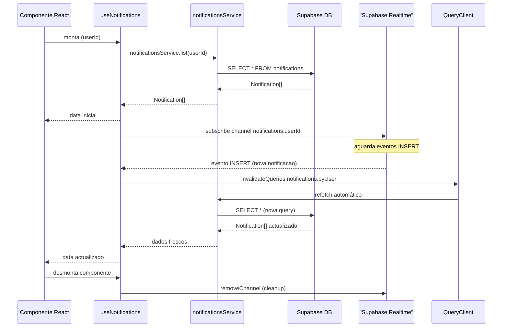
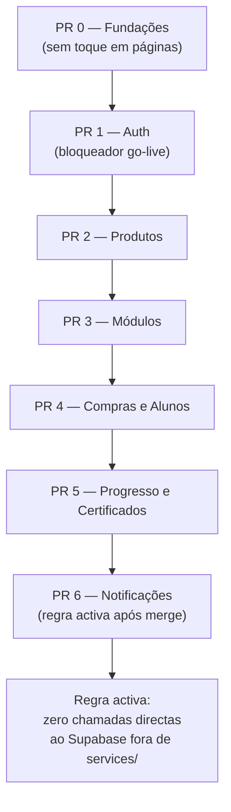
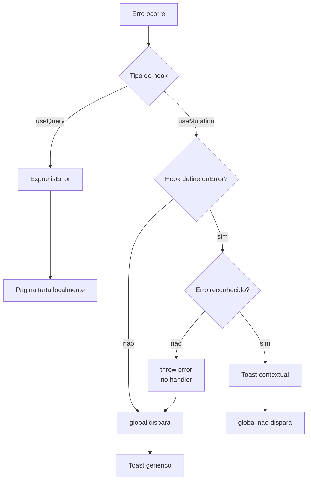

# Diagramas Mermaid — ServiceLayer

**FDD:** FDD-003 — ServiceLayer  
**Projecto:** APP XPRO  
**Data:** 2026-04-28

---

## Visão Geral

O ServiceLayer introduz uma fronteira explícita entre a UI e o acesso a dados no APP XPRO. A v1.0 actual tem 18 páginas que chamam o cliente Supabase directamente, misturando lógica de acesso a dados com lógica de apresentação. Após a migração, páginas e hooks comunicam apenas com serviços em `src/services/`; serviços comunicam com Supabase, Edge Functions e Storage. O plano de migração é incremental, organizado em PRs por domínio (PR 0 a PR 6), sem regressões.

---

## Elementos Identificados

### Fluxos Externos

- Páginas React chamam Supabase JS directamente (estado actual — a eliminar)
- Hooks de TanStack Query encapsulam queries e mutations por domínio
- Serviços de domínio chamam Supabase DB, Supabase Storage e Edge Functions
- `useNotifications` mantém subscrição Realtime do Supabase no ciclo de vida React

### Processos Internos

- `_edge.ts`: helper interno para invocar Edge Functions (não importado por páginas ou hooks)
- `storage.service.ts`: operações transversais de Storage (upload, signed URL, remove)
- Serviços de domínio: `auth`, `products`, `modules`, `purchases`, `progress`, `certificates`, `notifications`
- `keys.ts`: factory centralizado de queryKeys para TanStack Query
- `queryClient.ts`: QueryClient com `onError` global para mutations
- `supabase-errors.ts`: helper `isSupabaseError(error, code)` para erros Supabase conhecidos
- `domain.ts`: re-exports dos tipos auto-gerados do Supabase como aliases

### Variações de Comportamento

- Queries (`useQuery`): expõem `isError`/`error`; sem toast automático; página decide como mostrar
- Mutations (`useMutation`): `onError` contextual no hook para erros reconhecidos; propaga ao global para erros não reconhecidos; global dispara se hook não define `onError`
- staleTime varia por domínio: 0 (progresso, notificações) a 1 hora (certificados)
- Realtime mantido no hook `useNotifications`, não no serviço
- Módulos de vídeo: `video_url` é YouTube embed; sem signed URL; sem método `getVideoSignedUrl`

### Contratos Públicos

- Tipos de retorno: lista → array `[]` nunca `null`; singular → `null` se não encontrado; mutação → entidade; erro → exception propagada
- `src/types/domain.ts`: ponto único de importação de tipos de entidade nas páginas
- Regra pós-PR 6: zero chamadas directas ao Supabase fora de `src/services/`
- `_edge.ts` usado apenas por serviços de domínio; nunca por páginas ou hooks

---

## Diagramas

### Arquitectura Antes e Depois da Migração

Este diagrama de comparação mostra o estado actual (v1.0) e o estado alvo após o ServiceLayer, lado a lado. O diagrama de tipo Flowchart LR é adequado para evidenciar a separação de preocupações introduzida pela migração. À esquerda, as páginas acedem directamente ao Supabase, misturando camadas; à direita, a fronteira `src/services/` centraliza todo o acesso a dados. A comparação justifica a necessidade do ServiceLayer e serve de referência para qualquer revisão de código durante a migração.

**Notas:**

- No estado actual, 18 páginas chamam `supabase` directamente — lógica de UI misturada com acesso a dados
- No estado alvo, `src/services/` é a única fronteira autorizada para acesso ao Supabase
- Hooks de TanStack Query encapsulam `useQuery`/`useMutation` por domínio; páginas nunca vêem o cliente Supabase

---

### Direcção de Dependências por Camada

Este diagrama de fluxo vertical mostra a direcção única de dependências entre as quatro camadas do ServiceLayer. As setas fluem sempre de cima para baixo — páginas dependem de hooks, hooks dependem de serviços, serviços dependem do Supabase. Nenhuma camada inferior importa de uma camada superior. A clareza desta direcção é a regra central de arquitectura que o ServiceLayer impõe e que impede o acoplamento bidirecional que existe no estado actual.

**Notas:**

- Setas representam dependência de importação — a seta aponta para o que é importado
- Páginas nunca importam de `src/services/` directamente; sempre via hooks
- Serviços nunca importam de hooks ou páginas — sem dependência ascendente
- `Supabase JS Client` é importado directamente em cada serviço (sem injecção de dependência na v1.0)

---

### Fronteiras de Importação e Helpers Internos

Este diagrama detalha as regras de importação dentro da camada `src/services/`, que não são visíveis no diagrama de camadas anterior. O helper `_edge.ts` e o `storage.service.ts` são componentes transversais consumidos pelos serviços de domínio, mas nunca por páginas ou hooks directamente. O `domain.ts` é o único ponto de entrada de tipos de entidade para todo o codebase acima da camada de serviços. Este diagrama é essencial para revisões de código e onboarding, pois documenta restrições que não são aplicadas pelo compilador TypeScript.

**Notas:**

- `_edge.ts` não é importado por páginas ou hooks — apenas pelos serviços de domínio
- `storage.service.ts` é consumido pelos serviços de domínio; páginas nunca chamam `supabase.storage` directamente
- `domain.ts` re-exporta tipos auto-gerados do Supabase; é o único ponto de importação de tipos de entidade
- Quando o schema mudar, o impacto é visível apenas em `domain.ts`, sem alterações nas páginas

---

### Fluxo de Query com Invalidação de Cache

Este diagrama de sequência mostra o ciclo completo de uma query de leitura usando TanStack Query, desde a montagem do componente até à exibição dos dados. O fluxo exemplifica o `useProducts` e `productsService.list`, mas o padrão é idêntico para todos os domínios. A sequência torna explícito o papel do `queryClient` como cache intermediário e o `staleTime` como filtro que evita chamadas desnecessárias ao Supabase. Compreender este fluxo é fundamental para qualquer developer que precise de optimizar performance ou depurar dados desactualizados.

**Notas:**

- `staleTime: 5 * 60 * 1000` para produtos — dados ligeiramente desactualizados são aceitáveis para admins
- `staleTime: 0` para progresso e notificações — sempre frescos
- O `productsService.list()` retorna `[]` (array vazio) se não houver produtos — nunca `null`
- `queryFn` no hook aponta para o método do serviço; hooks nunca constroem queries Supabase directamente

---

### Fluxo de Mutação com Tratamento de Erros

Este diagrama de sequência mostra o ciclo completo de uma mutation, incluindo o tratamento diferenciado de erros reconhecidos e não reconhecidos. O exemplo usa `useCreateProduct` com o código de erro Supabase `23505` (unique constraint). O diagrama torna explícito o contrato de dois níveis de tratamento de erros: o hook trata erros de negócio conhecidos com toast contextual; erros desconhecidos são re-lançados para o `onError` global do QueryClient. Sem este diagrama, a convenção de `throw error` dentro do `onError` local seria contra-intuitiva para qualquer developer.

**Notas:**

- `isSupabaseError(error, '23505')` verifica se o erro é unique constraint violation
- Quando o hook faz `throw error` dentro do seu `onError`, o `onError` global do QueryClient dispara
- Hooks de query (`useQuery`) não têm toast automático — `isError`/`error` são expostos para a página decidir
- Outros códigos relevantes: `'23503'` (foreign key), `'42501'` (RLS), `'PGRST116'` (zero rows com `.single()`)

---

### Fluxo de Notificações com Realtime

Este diagrama de sequência mostra o comportamento especial do `useNotifications`, que combina uma query inicial com uma subscrição Realtime do Supabase. A subscrição é mantida no hook React por ser uma preocupação de ciclo de vida (mount/unmount), não no serviço de domínio. Este é o único domínio com `staleTime: 0` devido ao Realtime. O diagrama documenta explicitamente porque o Realtime não foi movido para `notifications.service.ts`, decisão que pode parecer inconsistente sem este contexto.

**Notas:**

- Realtime fica em `useNotifications` por ser preocupação de ciclo de vida React (mount/unmount)
- `notificationsService` é CRUD puro sem Realtime — a separação é intencional e explícita
- `staleTime: 0` garante que o cache nunca serve dados antigos após invalidação
- A subscrição filtra por `user_id=eq.${userId}` — cada utilizador tem o seu channel isolado

---

### Plano de Migração — PRs 0 a 6

Este diagrama de fluxo mostra a sequência dos sete PRs de migração e as suas dependências. O PR 0 (fundações) é pré-requisito para todos os seguintes, pois cria os ficheiros base sem tocar em nenhuma página. O PR 1 (Auth) é marcado como bloqueador de go-live e é o primeiro PR de domínio a implementar. A sequência recomendada é PR 1 → PR 2 → PR 3 → PR 4 → PR 5 → PR 6, com a regra de "zero chamadas directas" a entrar em vigor apenas após o merge do PR 6. O diagrama torna visível o caminho crítico da migração e ajuda a planear sprints ou revisões de código.

**Notas:**

- PR 0 cria apenas ficheiros novos (`_edge.ts`, `storage.service.ts`, `keys.ts`, `domain.ts`, `queryClient.ts`, `supabase-errors.ts`) — sem risco de regressão
- PR 1 refactoriza `useAuth.tsx` e `Signup.tsx`; é bloqueador de go-live por endereçar o Risco 2 do HLD
- Durante PRs 1–5, páginas ainda não migradas podem continuar a chamar Supabase directamente (temporariamente aceite)
- A regra de "zero chamadas directas" só entra em vigor após o merge do PR 6
- Recomendado registar no `CLAUDE.md` como regra temporária com data de activação após PR 6

---

### Contrato de Tratamento de Erros

Este diagrama de fluxo mostra os quatro cenários do contrato de tratamento de erros definido no FDD, tanto para mutations como para queries. O contrato distingue dois eixos: se o hook define `onError` ou não, e se o erro é reconhecido ou não. A clareza deste contrato é essencial para evitar que erros de negócio sejam engolidos silenciosamente pelo handler global, que é um dos riscos explicitamente identificados no FDD.

**Notas:**

- Queries (`useQuery`) nunca disparam toast automático — a página controla o empty state ou mensagem inline
- Quando o hook reconhece o erro e mostra toast contextual, o global não dispara (erro consumido)
- A convenção `throw error` dentro do `onError` local re-lança o erro para o global — sem esta convenção, erros não reconhecidos seriam engolidos silenciosamente
- `onError` global em `queryClient.ts` aplica-se apenas a mutations, não a queries
