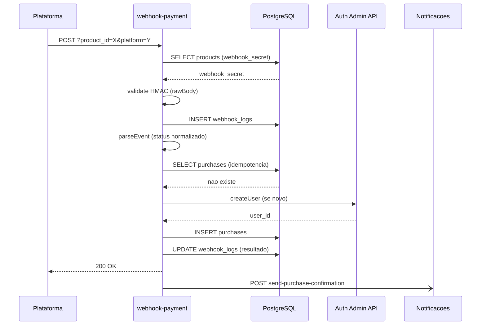
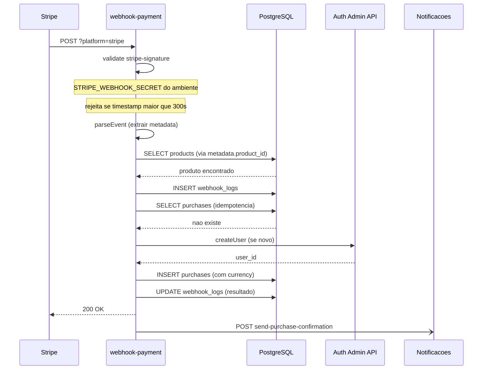
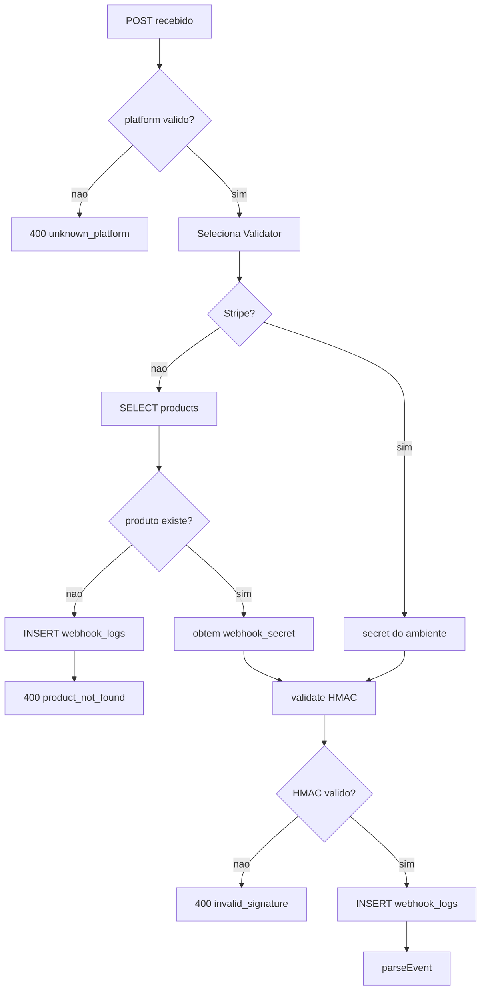
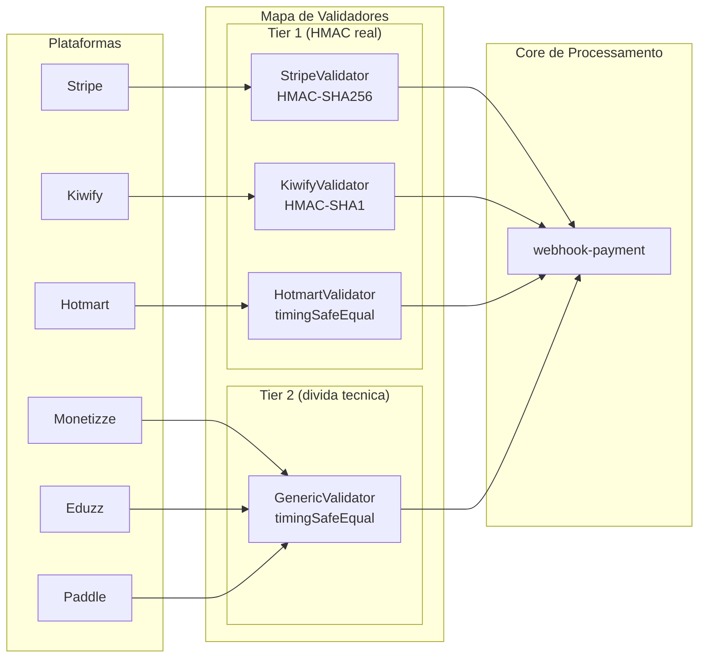
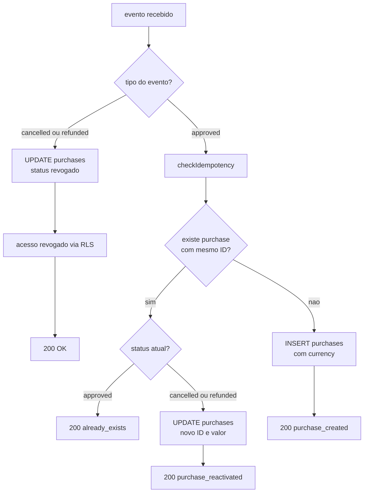
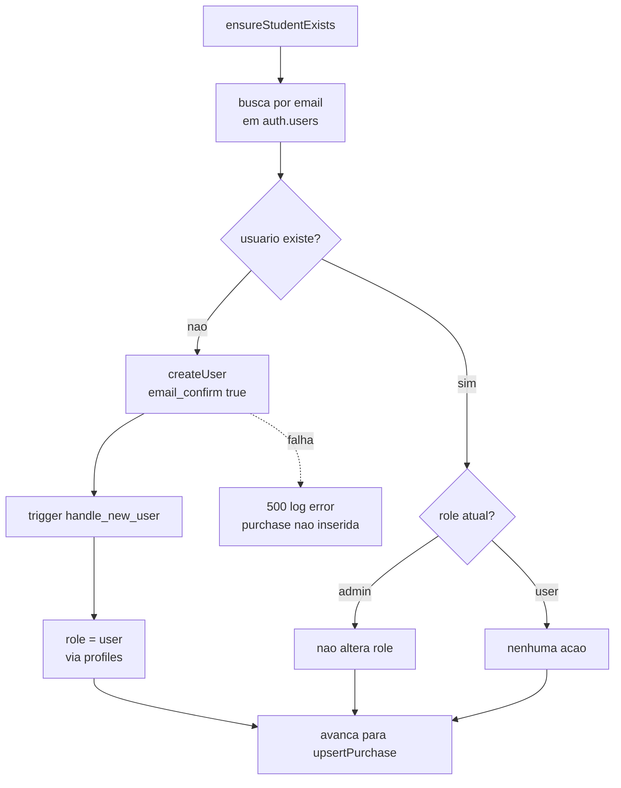
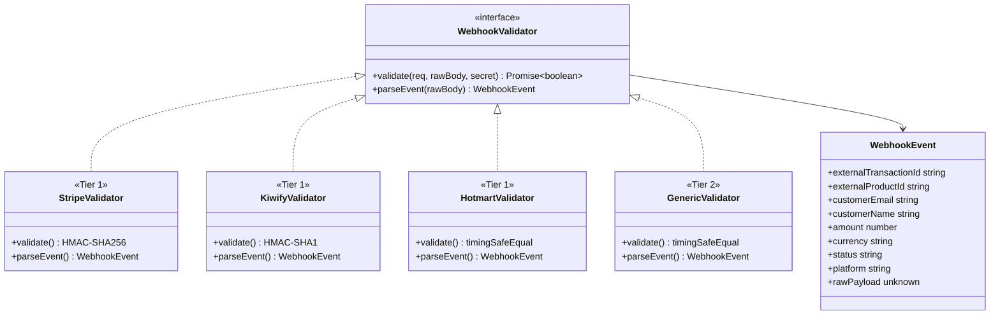
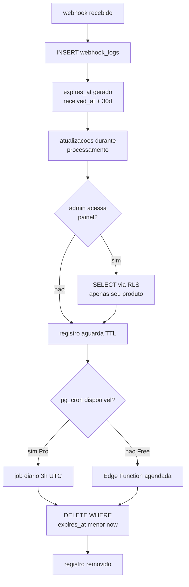

# Diagramas Mermaid - Webhook de Pagamento

## Visão Geral

O `webhook-payment` é a Edge Function central que recebe, valida e processa eventos de pagamento de seis plataformas externas (Hotmart, Kiwify, Stripe, Monetizze, Eduzz, Paddle). A arquitetura é baseada em plugins: cada plataforma possui um `WebhookValidator` independente, e adicionar uma nova plataforma não altera o core de processamento. O sistema garante idempotência por `UNIQUE(external_transaction_id)` em `purchases`, auditoria completa em `webhook_logs` com TTL de 30 dias, e isolamento de secret por produto via `products.webhook_secret`.

---

## Elementos Identificados

### Fluxos Externos

- `POST /functions/v1/webhook-payment?platform=<nome>[&product_id=<uuid>]` recebido das plataformas
- Resposta 200 para sucesso, duplicata idempotente e evento desconhecido
- Resposta 400 para HMAC inválido, plataforma desconhecida, produto não encontrado, replay attack Stripe
- Resposta 500 para erros transientes (plataforma retenta com backoff exponencial)
- Chamada assíncrona a `send-purchase-confirmation` com `{ purchase_id, user_email }`
- Chamada assíncrona a `send-notification` com `{ user_id, type: 'warning', message }`

### Processos Internos

- Seleção de `WebhookValidator` por plataforma no mapa de validadores
- `validateRequest()`: lê `rawBody` como `Uint8Array` antes de qualquer parse; executa `validator.validate()`
- `logWebhookReceived()`: INSERT em `webhook_logs` antes de qualquer operação de negócio
- `validator.parseEvent()`: constrói `WebhookEvent`; mapeia evento da plataforma para status normalizado
- `checkIdempotency()`: SELECT em `purchases` por `external_transaction_id`
- `ensureStudentExists()`: busca por e-mail em `auth.users`; cria conta se não existir
- `upsertPurchase()`: INSERT para nova compra, UPDATE para reativação ou cancelamento/reembolso
- `notifyStudent()`: execução paralela e fire-and-forget; falha não reverte a compra

### Variações de Comportamento

- Stripe usa `STRIPE_WEBHOOK_SECRET` global de ambiente; produto identificado via `metadata.product_id`
- Demais plataformas: `product_id` na query string; secret buscado em `products.webhook_secret`
- Tier 1: Stripe (HMAC-SHA256 via lib oficial), Kiwify (HMAC-SHA1 no raw body), Hotmart (timingSafeEqual)
- Tier 2: `GenericValidator` com timingSafeEqual para Monetizze, Eduzz, Paddle (dívida técnica)
- Reativação: compra `cancelled`/`refunded` recebe novo `approved` com `external_transaction_id` diferente
- Replay attack Stripe: timestamp do `stripe-signature` com tolerância superior a 300s retorna 400

### Contratos Públicos

- Interface `WebhookValidator` com métodos `validate()` e `parseEvent()`
- Interface `WebhookEvent` com campos: `externalTransactionId`, `customerEmail`, `amount`, `currency`, `status`, `platform`, `rawPayload`
- Tabela `webhook_logs`: `received_at`, `platform`, `raw_headers`, `raw_body`, `validation_result`, `processing_result`, `expires_at`
- Coluna `currency` em `purchases` para suporte a ISO 4217 (EUR, USD, BRL e outros)

---

## Diagramas

### Fluxo Principal (Plataformas não-Stripe)

Este diagrama de sequência representa o caminho feliz completo de um webhook de plataforma não-Stripe, desde o POST inicial até o retorno 200. Cobre as etapas de validação HMAC, criação do log de auditoria, verificação de idempotência, criação de aluno e persistência da compra em sequência. As notificações são disparadas de forma assíncrona após o retorno 200, evidenciando o padrão fire-and-forget que isola falhas de notificação do fluxo principal. Este diagrama é o ponto de entrada mais importante para compreender como todos os componentes se integram.

**Notas**:
- `rawBody` lido como `Uint8Array` antes de qualquer parse JSON; nunca convertido antes da validação HMAC
- `webhook_logs` é inserido antes de qualquer operação de negócio; toda falha parcial é auditável
- A seta `-)` representa chamada assíncrona fire-and-forget; falha em `Notif` não reverte a compra
- Se o aluno já existe em `auth.users`, `ensureStudentExists` pula a criação e avança

---

### Fluxo Stripe

Este diagrama de sequência cobre o fluxo específico do Stripe, que difere das demais plataformas em dois aspectos críticos: o secret de validação vem de variável de ambiente (`STRIPE_WEBHOOK_SECRET` global) e o `product_id` é extraído de `metadata.product_id` dentro do evento já validado, não da query string. O replay attack é bloqueado na fase de validação quando o timestamp do `stripe-signature` excede 300 segundos de tolerância. Compreender este fluxo separado é essencial porque a ordem das operações muda: a busca de produto acontece após a validação, não antes.

**Notas**:
- `STRIPE_WEBHOOK_SECRET` global de conta; não há `product_id` na query string para Stripe
- Produto identificado via `event.data.object.metadata.product_id` após validação bem-sucedida
- Replay attack: Stripe SDK rejeita eventos com timestamp superior a 300s antes de qualquer operação de DB
- Campo `currency` em `purchases` persiste o código ISO 4217 do evento (ex: `EUR` para conta europeia)

---

### Validação e Roteamento Inicial

Este fluxograma representa as decisões de roteamento e validação que ocorrem antes da inserção do `webhook_log`, correspondendo aos passos 2 e 3 do fluxo principal. A lógica de early-exit é central para a segurança: plataformas desconhecidas e assinaturas inválidas são rejeitadas sem nenhum registro em banco de dados, o que evita poluição de auditoria com tentativas inválidas. Cada ramificação tem uma resposta HTTP específica, tornando este diagrama útil como referência rápida para diagnóstico de erros 400.

**Notas**:
- `platform` desconhecido retorna 400 sem inserir `webhook_log`
- HMAC inválido retorna 400 sem inserir `webhook_log`; replay attack Stripe também retorna 400 aqui
- Para plataformas não-Stripe, `product_not_found` resulta em INSERT de `webhook_log` antes do 400
- `webhook_secret` nunca logado nem retornado em resposta

---

### Arquitetura Plugin de Validadores

Este fluxograma de comparação lateral ilustra a separação entre Tier 1 e Tier 2 na arquitetura plugin, mostrando como cada plataforma conecta ao core de processamento através da interface `WebhookValidator`. A divisão é relevante porque indica claramente onde está a dívida técnica (Tier 2) e quais plataformas possuem HMAC real (Tier 1). Adicionar uma nova plataforma requer apenas implementar `WebhookValidator` e registar no mapa; o core permanece inalterado.

**Notas**:
- Tier 1: Stripe usa lib oficial npm; Kiwify usa HMAC-SHA1 no `rawBody` como `Uint8Array`; Hotmart usa comparação de tempo constante
- Tier 2: `GenericValidator` usa header `x-webhook-signature` com `timingSafeEqual`; HMAC real é dívida técnica para iteração seguinte
- `products.webhook_secret` alimenta todos os validadores exceto Stripe (que usa variável de ambiente)
- Nova plataforma: implementar `WebhookValidator`, registar no mapa; zero alteração no core

---

### Idempotência e Reativação de Compra

Este fluxograma representa a lógica de `checkIdempotency` e `upsertPurchase`, que é o coração da garantia de segurança contra duplicatas e retries das plataformas. O diagrama evidencia três caminhos distintos: compra nova, duplicata idempotente (retorna 200 sem ação) e reativação (compra cancelada/reembolsada recebe novo `approved` com `external_transaction_id` diferente). Este é um dos aspectos mais não-óbvios do sistema, pois o tratamento de reativação usa UPDATE em vez de INSERT e lookup por `(user_id, product_id)`.

**Notas**:
- Idempotência garantida por `UNIQUE(external_transaction_id)` em `purchases`
- Reativação usa UPDATE em `purchases` por `(user_id, product_id)`; `external_transaction_id` e `amount_paid` são atualizados
- Cancelamento/reembolso: RLS avaliada em tempo real no PostgreSQL; sem cache de sessão a invalidar
- Dois requests simultâneos com mesmo ID: o segundo falha na constraint UNIQUE e retorna 500; retry encontra idempotência

---

### Criação de Aluno (ensureStudentExists)

Este fluxograma detalha a lógica de `ensureStudentExists`, que é executada após a verificação de idempotência e antes do `upsertPurchase`. A decisão de não enviar link de recovery é um invariante crítico: o e-mail de confirmação de compra contém as instruções de acesso. Outro ponto não-óbvio é o tratamento de role: se o e-mail já pertence a um admin, o role não é alterado, evitando downgrade acidental de privilégios.

**Notas**:
- `createUser` chamado com `email_confirm: true`; sem envio de link de recovery
- Trigger `handle_new_user` cria automaticamente `profiles` e `user_roles` com `role = 'user'`
- Admin preexistente: role não é alterado para evitar downgrade acidental de privilégios
- Falha em `createUser` retorna 500; a plataforma retenta com backoff exponencial

---

### Contratos da Arquitetura Plugin

Este diagrama de classes expõe as duas interfaces TypeScript internas que definem o contrato da arquitetura plugin: `WebhookValidator` e `WebhookEvent`. São os únicos contratos que cada implementador de nova plataforma precisa respeitar. A relação entre as interfaces e os validadores concretos mostra como Tier 1 e Tier 2 implementam o mesmo contrato, e como `WebhookEvent` é o tipo normalizado que o core de processamento consome independente da plataforma.

**Notas**:
- `status` em `WebhookEvent` é sempre normalizado para `approved`, `cancelled` ou `refunded`
- `currency` segue ISO 4217 (`EUR`, `USD`, `BRL` e outros); persistido em `purchases.currency`
- `rawPayload` é o payload bruto da plataforma; persistido em `webhook_logs.raw_body`
- `GenericValidator` aceita Monetizze, Eduzz e Paddle; HMAC real é dívida técnica registada

---

### Ciclo de Vida do webhook_log e Purga

Este fluxograma representa o ciclo de vida completo de um registro em `webhook_logs`, desde a inserção inicial até a purga automática pelo pg_cron. A coluna `expires_at` é gerada automaticamente como `received_at + 30 days`, eliminando a possibilidade de registros sem TTL. O diagrama também ilustra o fallback para ambientes sem pg_cron (plano Supabase Free), onde a purga é feita por Edge Function agendada.

**Notas**:
- `expires_at` é coluna gerada (`GENERATED ALWAYS AS`) e nunca editável manualmente
- RLS em `webhook_logs`: admin vê apenas logs dos seus produtos via `product_id -> products.admin_id`
- INSERT e UPDATE apenas via Service Role Key da Edge Function; DELETE apenas via pg_cron ou Service Role
- `raw_body` contém PII (e-mail, nome); TTL 30 dias e RLS restritiva são a mitigação em v1.0
- Fallback Free: mesma instrução SQL de purga executada por Supabase Scheduled Functions
